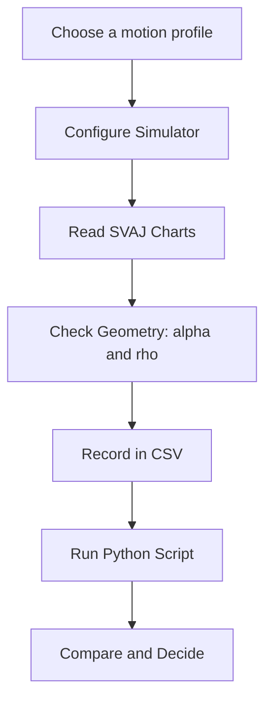

import TawkWidget from '../../../../components/TawkWidget.astro';
import UniversalContentContributors from '../../../../components/UniversalContentContributors.astro';
import InArticleAd from '../../../../components/InArticleAd.astro';
import Copyright from '../../../../components/Copyright.astro';
import BionicText from '../../../../components/BionicText.astro';
import TailwindWrapper from '../../../../components/TailwindWrapper.jsx';
import { Tabs, TabItem } from '@astrojs/starlight/components';
import { Card, CardGrid, Badge, Steps, LinkButton, FileTree } from '@astrojs/starlight/components';

<UniversalContentContributors 
  contributors={frontmatter.contributors}
/>


import MechanismDesignSimulationComments from '../../../../components/mechanism-design-simulation/MechanismDesignSimulationComments.astro';

A cam looks like the simplest mechanism there is: a shaped disk that pushes a follower up and down. The catch is that the displacement you draw is the least important thing about it. Run the cam fast and the machine's life is decided by the second and third derivatives of that curve, the acceleration and the jerk, which you never see by looking at the shape. These six experiments train the habit every cam designer needs: design the motion by its derivatives, let the fundamental law throw out the profiles that secretly misbehave, and only then check the geometry the profile forces on the cam. #CamDesign #SVAJ #MechanismDesign

:::tip[What you need]
The [Cam and Follower Mechanism Simulator](/product-development/cam-follower-mechanism-simulator/), and Python 3 with NumPy and Matplotlib for the analysis scripts (`pip install numpy matplotlib`).
:::

:::note[Related resources]
Model the cam parametrically in the [FreeCAD Cam and Follower lesson](/education/parametric-mechanical-cad-freecad/cam-and-follower-mechanism), see the full tool set on the [2D Mechanisms Analyzer](/product-development/2d-mechanisms-analyzer/) page, and try the companion [Toggle Clamp Experiments](/education/mechanism-design-simulation/toggle-clamp-experiments) for an over-centre force study.
:::

## Reference

| Term | Meaning |
|------|---------|
| **SVAJ** | Displacement s, velocity v = ds/dθ, acceleration a = d²s/dθ², jerk j = d³s/dθ³, the four curves that define a cam |
| **Fundamental law** | The displacement must be continuous through velocity and acceleration over the full 360°, with finite jerk; otherwise vibration is built in |
| **Profile** | The rise or fall law (cycloidal, polynomial, simple harmonic, etc.) that shapes one segment of the motion |
| **Cv, Ca, Cj** | Dimensionless peak coefficients: v_peak = Cv·h/β, a_peak = Ca·h·ω²/β², j_peak = Cj·h·ω³/β³ |
| **Pressure angle (α)** | Angle between the follower motion and the cam contact force; kept below about 30° for a translating follower so it does not jam |
| **Base / prime circle** | Base-circle radius rb is the smallest cam radius; prime-circle radius Rp = rb + rr is the roller-centre circle |
| **Radius of curvature (ρ)** | Local curvature of the pitch curve; a roller undercuts the cam when ρ drops below the roller radius |
| **Follower jump** | At high speed the inertia force overcomes the spring and the follower loses contact with the cam |

### Experiment Workflow



### Workspace Setup

<FileTree>
- cam-follower-experiments/
  - data/
  - plots/
  - scripts/
</FileTree>

---

## Experiment 1: SVAJ and the Fundamental Law of Cam Design

<InArticleAd />


Two cams can produce the exact same lift over the exact same angle and yet one runs silently at speed while the other hammers itself to pieces. The difference never shows in the displacement curve; it shows in the acceleration. This experiment plots the full SVAJ chain for three rise profiles and makes the fundamental law of cam design visible: where the acceleration jumps, the jerk goes infinite, and the cam will vibrate.

:::note[Objective]
Plot displacement, velocity, acceleration, and jerk for a constant-velocity, a constant-acceleration, a simple-harmonic, and a cycloidal rise, and identify which obey the fundamental law (continuous acceleration, finite jerk) and which do not.
:::

<Steps>
1. **Configure the simulator**
   Open the simulator and select the Textbook double-dwell preset. In the Motion program panel set the rise profile to Cycloidal. Open the Acceleration and Jerk charts.

2. **Predict**
   The fundamental law says the acceleration must be continuous through the segment boundaries. Predict that cycloidal (acceleration zero at both ends) joins the dwells smoothly, while simple harmonic (acceleration non-zero at the ends) jumps where the rise meets a dwell.

3. **Sweep the profiles**
   Change the rise profile to Constant velocity, then Constant acceleration, then Simple harmonic, then Cycloidal. Each time, watch the Acceleration chart for a vertical step at a segment boundary and read the peak acceleration from the summary.

4. **Find the law-breakers**
   Note which profiles flag "VIOLATES" in the acceleration summary. Read the peak acceleration for each profile from the summary panel.

5. **Save data**
   Create `data/exp1_svaj.csv` with columns: profile, peak_accel_sim, obeys_law (1 or 0).
</Steps>

### Data Collection Table

| Profile | Peak acceleration (mm/s²) | Obeys law? |
|---------|---------------------------|------------|
| Constant velocity | | |
| Constant acceleration | | |
| Simple harmonic | | |
| Cycloidal | | |

### Python Analysis

```python title="experiment_1_svaj.py"
# Cam Experiment 1: SVAJ and the Fundamental Law of Cam Design
import numpy as np
import matplotlib.pyplot as plt
import os

os.makedirs('plots', exist_ok=True)

# Normalized profiles over a unit rise, x in [0,1]. Return S, V, A, J = dS/dx and derivatives.
def svaj(profile, x):
    tp = 2 * np.pi
    if profile == 'const-velocity':
        return x, np.ones_like(x), np.zeros_like(x), np.zeros_like(x)
    if profile == 'const-accel':
        S = np.where(x <= 0.5, 2 * x**2, 1 - 2 * (1 - x)**2)
        V = np.where(x <= 0.5, 4 * x, 4 * (1 - x))
        A = np.where(x <= 0.5, 4.0, -4.0)
        return S, V, A, np.zeros_like(x)
    if profile == 'simple-harmonic':
        return (0.5 * (1 - np.cos(np.pi * x)), (np.pi / 2) * np.sin(np.pi * x),
                (np.pi**2 / 2) * np.cos(np.pi * x), -(np.pi**3 / 2) * np.sin(np.pi * x))
    if profile == 'cycloidal':
        return (x - np.sin(tp * x) / tp, 1 - np.cos(tp * x),
                tp * np.sin(tp * x), tp**2 * np.cos(tp * x))
    raise ValueError(profile)

# Physical scaling: a rise of lift h over angular width beta (deg) at cam speed rpm.
h, beta_deg, rpm = 20.0, 90.0, 180.0
beta = np.deg2rad(beta_deg)
omega = rpm * 2 * np.pi / 60.0
x = np.linspace(0, 1, 600)

profiles = ['const-velocity', 'const-accel', 'simple-harmonic', 'cycloidal']
colors = {'const-velocity': '#ef4444', 'const-accel': '#f97316',
          'simple-harmonic': '#E9C46A', 'cycloidal': '#2A9D8F'}

fig, axes = plt.subplots(2, 2, figsize=(13, 9))
labels = ['Displacement s (mm)', 'Velocity v (mm/s)', 'Acceleration a (mm/s2)', 'Jerk j (mm/s3)']
for profile in profiles:
    S, V, A, J = svaj(profile, x)
    s = h * S
    v = (h / beta) * V * omega
    a = (h / beta**2) * A * omega**2
    j = (h / beta**3) * J * omega**3
    for ax, y in zip(axes.ravel(), [s, v, a, j]):
        ax.plot(x * beta_deg, y, color=colors[profile], lw=2, label=profile)

for ax, lab in zip(axes.ravel(), labels):
    ax.set_xlabel('Angle through rise (deg)'); ax.set_ylabel(lab)
    ax.grid(True, alpha=0.3); ax.legend(fontsize=8)
axes[0, 0].set_title('Displacement looks fine for all four')
axes[1, 0].set_title('Acceleration: the law-breakers jump at the ends')
plt.tight_layout()
plt.savefig('plots/exp1_svaj.png', dpi=150, bbox_inches='tight')
plt.show()

print("Join condition at the dwell boundary (x=0): the rise must start with v=0 AND a=0,")
print("because the dwell it meets has both zero. A step in either one breaks the law.")
for profile in profiles:
    _, V0, A0, _ = svaj(profile, np.array([0.0]))
    v0 = (h / beta) * V0[0] * omega
    a0 = (h / beta**2) * A0[0] * omega**2
    obeys = abs(v0) < 1e-6 and abs(a0) < 1e-6
    print(f"  {profile:16s}: v(0) = {v0:7.1f} mm/s, a(0) = {a0:9.0f} mm/s2  -> "
          f"{'joins smoothly (OK)' if obeys else 'STEP at the dwell join'}")
print("\nOnly cycloidal starts and ends with both v and a at zero, so it joins the dwells")
print("without a step. Constant velocity steps in v (an infinite acceleration spike);")
print("constant acceleration and simple harmonic step in a (an infinite jerk spike).")
```

### Expected Results

- All four displacement curves look almost identical; the differences only appear in acceleration and jerk
- Constant velocity has an infinite acceleration spike at each end (the velocity jumps from zero), constant acceleration has a finite step at the ends and at mid-rise, and simple harmonic starts and ends with a non-zero acceleration so it steps where it meets a dwell
- Only the cycloidal rise has zero acceleration at both ends, so its acceleration is continuous across the segment boundaries and its jerk stays finite
- The simulator flags the first three as "VIOLATES" and the cycloidal as "Obeys cam law"

### Design Question

A colleague says their cam "moves smoothly, I checked the displacement curve and it has no kinks." Why is that not enough to trust the cam at 1500 rpm, and which two curves would you ask to see instead?

---

## Experiment 2: The Motion-Profile Shoot-Out

<InArticleAd />


Once you keep only the profiles that obey the fundamental law, you still have to choose between them, and they are not equal. A cycloidal rise is the gentlest on jerk but demands the highest peak acceleration (and therefore the largest inertia force); a modified trapezoid minimizes peak acceleration but pays for it in jerk. This experiment puts the law-abiding profiles head to head using the dimensionless coefficients engineers actually compare.

:::note[Objective]
Measure the dimensionless peak coefficients Cv, Ca, and Cj for the main motion profiles, and decide which profile minimizes peak acceleration and which minimizes jerk.
:::

<Steps>
1. **Configure the simulator**
   Select the High-speed precision preset (cycloidal rise). Keep the lift, rise angle, and speed fixed so only the profile changes.

2. **Predict**
   Peak acceleration scales with Ca and peak jerk with Cj. Predict that cycloidal gives the largest peak acceleration among the smooth profiles, while modified trapezoid gives the smallest.

3. **Sweep the smooth profiles**
   Set the rise profile in turn to Cycloidal, Modified trapezoid, Modified sine, 3-4-5 polynomial, and 4-5-6-7 polynomial. At each, read the peak acceleration from the summary (lift, rise angle, and speed held constant).

4. **Back out the coefficient**
   The coefficient is Ca = a_peak · β² / (h · ω²). Compute it for each profile and compare with the table below.

5. **Save data**
   Create `data/exp2_profiles.csv` with columns: profile, peak_accel_sim_mm_s2.
</Steps>

### Data Collection Table

| Profile | Peak accel (mm/s²) | Back-calculated Ca |
|---------|--------------------|--------------------|
| Cycloidal | | |
| Modified trapezoid | | |
| Modified sine | | |
| 3-4-5 polynomial | | |
| 4-5-6-7 polynomial | | |

### Python Analysis

```python title="experiment_2_profiles.py"
# Cam Experiment 2: The Motion-Profile Shoot-Out
import numpy as np
import matplotlib.pyplot as plt
import os

os.makedirs('plots', exist_ok=True)

# Build normalized S, V(=dS/dx), A(=d2S/dx2), J(=d3S/dx3) on a fine grid for each profile.
N = 4000
x = np.linspace(0, 1, N + 1)
tp = 2 * np.pi

def closed(profile):
    if profile == 'cycloidal':
        return (x - np.sin(tp * x) / tp, 1 - np.cos(tp * x), tp * np.sin(tp * x), tp**2 * np.cos(tp * x))
    if profile == '3-4-5':
        return (10*x**3 - 15*x**4 + 6*x**5, 30*x**2 - 60*x**3 + 30*x**4,
                60*x - 180*x**2 + 120*x**3, 60 - 360*x + 360*x**2)
    if profile == '4-5-6-7':
        return (35*x**4 - 84*x**5 + 70*x**6 - 20*x**7,
                140*x**3 - 420*x**4 + 420*x**5 - 140*x**6,
                420*x**2 - 1680*x**3 + 2100*x**4 - 840*x**5,
                840*x - 5040*x**2 + 8400*x**3 - 4200*x**4)
    raise ValueError(profile)

# Modified trapezoid / modified sine: define the unit-amplitude acceleration shape, then
# integrate twice and normalize so S(1)=1 (exactly how the simulator builds them).
def integral_profile(kind):
    if kind == 'mod-trap':
        A0 = np.where(x < 0.125, np.sin(4*np.pi*x),
             np.where(x < 0.375, 1.0,
             np.where(x < 0.625, np.sin(4*np.pi*(x - 0.25)),
             np.where(x < 0.875, -1.0, np.sin(4*np.pi*(x - 1))))))
    else:  # mod-sine
        A0 = np.where(x < 0.125, np.sin(4*np.pi*x),
             np.where(x < 0.875, np.sin((4*np.pi/3)*(x - 0.125) + np.pi/2),
             np.sin(4*np.pi*(x - 1))))
    V0 = np.concatenate([[0], np.cumsum(0.5*(A0[1:] + A0[:-1]) * np.diff(x))])
    S0 = np.concatenate([[0], np.cumsum(0.5*(V0[1:] + V0[:-1]) * np.diff(x))])
    scale = 1.0 / S0[-1]
    return S0*scale, V0*scale, A0*scale  # A amplitude == Ca

profiles = {}
for p in ['cycloidal', '3-4-5', '4-5-6-7']:
    S, V, A, J = closed(p)
    profiles[p] = dict(Cv=np.max(np.abs(V)), Ca=np.max(np.abs(A)), Cj=np.max(np.abs(J)))
for kind, name in [('mod-trap', 'modified trapezoid'), ('mod-sine', 'modified sine')]:
    S, V, A = integral_profile(kind)
    # jerk = dA/dx via gradient (finite Cj for these profiles)
    J = np.gradient(A, x)
    profiles[name] = dict(Cv=np.max(np.abs(V)), Ca=np.max(np.abs(A)), Cj=np.max(np.abs(J)))

print(f"{'Profile':20s} {'Cv':>7s} {'Ca':>8s} {'Cj':>8s}")
for name, c in profiles.items():
    print(f"{name:20s} {c['Cv']:7.4f} {c['Ca']:8.4f} {c['Cj']:8.2f}")

names = list(profiles.keys())
Ca = [profiles[n]['Ca'] for n in names]
Cj = [profiles[n]['Cj'] for n in names]
fig, axes = plt.subplots(1, 2, figsize=(13, 5))
axes[0].bar(names, Ca, color='#2A9D8F'); axes[0].set_ylabel('Peak accel coefficient Ca')
axes[0].set_title('Lower Ca = smaller inertia force')
axes[1].bar(names, Cj, color='#E9C46A'); axes[1].set_ylabel('Peak jerk coefficient Cj')
axes[1].set_title('Lower Cj = smoother, less vibration')
for ax in axes:
    ax.tick_params(axis='x', rotation=30); ax.grid(True, alpha=0.3, axis='y')
plt.tight_layout()
plt.savefig('plots/exp2_profiles.png', dpi=150, bbox_inches='tight')
plt.show()

best_a = min(profiles, key=lambda n: profiles[n]['Ca'])
best_j = min(profiles, key=lambda n: profiles[n]['Cj'])
print(f"\nLowest peak acceleration: {best_a}")
print(f"Lowest peak jerk:         {best_j}")
```

### Expected Results

- The coefficients come out close to the textbook values: cycloidal Cv 2.00, Ca 6.28, Cj 39.5; modified trapezoid Ca about 4.89; modified sine Ca about 5.53; 3-4-5 Ca about 5.77; 4-5-6-7 Ca about 7.51
- Modified trapezoid has the lowest peak acceleration of the group, so it produces the smallest inertia force at a given speed
- Cycloidal has the lowest peak jerk of the classical profiles, so it is the smoothest, at the cost of the highest peak acceleration among them
- The back-calculated Ca from your simulator readings matches these to within reading error

### Design Question

For a high-speed cam where the spring must hold the follower against the inertia force, would you favour the profile with the lowest Ca or the lowest Cj, and why? When would the answer flip?

---

## Experiment 3: Pressure Angle and Cam Sizing

<InArticleAd />


You have chosen a good motion profile, but you cannot pick the cam's size freely: make the base circle too small and the pressure angle climbs until the follower jams in its guide instead of moving. The pressure angle is the first thing that sets the minimum cam size. This experiment maps it, finds where it crosses the 30-degree limit, and uses follower offset to buy some of it back on the rise.

:::note[Objective]
Measure how the maximum pressure angle depends on the base-circle radius, find the smallest base circle that keeps it under 30 degrees, and quantify how follower offset reduces the pressure angle on the rise.
:::

<Steps>
1. **Configure the simulator**
   Select the Automation index cam preset (roller follower, cycloidal or modified-trapezoid rise). Open the Pressure angle chart with its 30-degree limit lines.

2. **Predict**
   The pressure angle decreases as the base circle grows. Predict roughly the base-circle radius at which the maximum pressure angle drops to 30 degrees.

3. **Sweep the base circle**
   Set the base-circle radius to 20, 30, 40, 50, and 60 mm. At each, read the maximum pressure angle from the summary.

4. **Add offset**
   Return to a base radius where the rise pressure angle is high. Set the follower offset to 0, then a positive value, and record the pressure angle during the rise; note how the fall side changes.

5. **Save data**
   Create `data/exp3_pressure.csv` with columns: base_radius_mm, alpha_max_sim_deg.
</Steps>

### Data Collection Table

| Base radius (mm) | Max pressure angle (deg) |
|------------------|--------------------------|
| 20 | |
| 30 | |
| 40 | |
| 50 | |
| 60 | |

### Python Analysis

```python title="experiment_3_pressure.py"
# Cam Experiment 3: Pressure Angle and Cam Sizing
import numpy as np
import matplotlib.pyplot as plt
import os

os.makedirs('plots', exist_ok=True)

# Double-dwell program: dwell, cycloidal rise, dwell, cycloidal fall, dwell (degrees).
h = 25.0           # lift (mm)
rr = 10.0          # roller radius (mm)
prog = [('dwell', 45), ('rise', 90), ('dwell', 90), ('fall', 90), ('dwell', 45)]

def cycloidal(x):
    tp = 2 * np.pi
    return x - np.sin(tp*x)/tp, 1 - np.cos(tp*x)   # S, V=dS/dx

def s_and_v(theta_deg):
    """Return follower displacement s (mm) and v = ds/dtheta (mm/rad) at a cam angle."""
    start, lift = 0.0, 0.0
    n = len(prog)
    for i, (kind, dur) in enumerate(prog):
        last = (i == n - 1)
        if (start <= theta_deg < start + dur) or (last and theta_deg >= start):
            if kind == 'dwell':
                return lift, 0.0
            x = (theta_deg - start) / dur
            S, V = cycloidal(x)
            beta = np.deg2rad(dur)
            sign = 1.0 if kind == 'rise' else -1.0
            return lift + sign * h * S, sign * h * V / beta
        if kind == 'rise':
            lift += h
        elif kind == 'fall':
            lift -= h
        start += dur
    return lift, 0.0

def max_pressure_angle(base_radius, eps=0.0):
    Rp = base_radius + rr
    thetas = np.arange(0, 360, 0.5)
    amax = 0.0
    for th in thetas:
        s, v = s_and_v(th)
        denom = s + np.sqrt(max(Rp**2 - eps**2, 1e-9))
        alpha = np.degrees(np.arctan2(v - eps, denom))
        amax = max(amax, abs(alpha))
    return amax

radii = np.array([20, 25, 30, 35, 40, 45, 50, 55, 60], dtype=float)
amax = np.array([max_pressure_angle(rb) for rb in radii])

plt.figure(figsize=(8, 5))
plt.plot(radii, amax, 'o-', color='#2A9D8F', lw=2, label='Max pressure angle')
plt.axhline(30, color='#ef4444', ls='--', label='30 deg limit')
plt.xlabel('Base-circle radius rb (mm)'); plt.ylabel('Max pressure angle (deg)')
plt.title('A bigger base circle lowers the pressure angle')
plt.legend(); plt.grid(True, alpha=0.3)
plt.tight_layout()
plt.savefig('plots/exp3_pressure.png', dpi=150, bbox_inches='tight')
plt.show()

below = radii[amax <= 30]
print("Max pressure angle vs base radius:")
for rb, a in zip(radii, amax):
    print(f"  rb={rb:4.0f} mm -> alpha_max = {a:5.1f} deg  {'OK' if a <= 30 else 'too high'}")
if below.size:
    print(f"Smallest base radius keeping alpha <= 30 deg: about {below[0]:.0f} mm")

# Offset effect at a tight base radius: pressure angle through the RISE only.
rb_tight = 22.0
print(f"\nOffset effect at rb = {rb_tight:.0f} mm (rise-side pressure angle near mid-rise):")
for eps in [0, 5, 10]:
    s, v = s_and_v(90.0)   # mid-rise
    denom = s + np.sqrt(max((rb_tight + rr)**2 - eps**2, 1e-9))
    a = np.degrees(np.arctan2(v - eps, denom))
    print(f"  offset={eps:2d} mm -> alpha = {a:5.1f} deg")
print("Positive offset subtracts from the rise velocity term, easing the rise (it costs you on the fall).")
```

### Expected Results

- The maximum pressure angle falls steadily as the base-circle radius grows, roughly like 1 over the radius
- For the default automation cam (25 mm lift, 90-degree rise, 10 mm roller) the maximum pressure angle falls from about 38 degrees at a 20 mm base radius to under 30 degrees by about a 33 to 35 mm base radius
- Adding positive follower offset lowers the pressure angle during the rise (the velocity term has the offset subtracted) while raising it on the fall, so offset is a directional fix for the load-critical phase
- The simulator's pressure-angle chart crosses its red 30-degree line at the same base radius your sweep predicts

### Design Question

You are tempted to fix a high pressure angle by simply enlarging the base circle. Name two costs of an oversized cam, and explain when follower offset is the better fix and when it is not.

---

## Experiment 4: Radius of Curvature and Undercutting

<InArticleAd />


The pressure angle is only the first geometric limit. The second is sharper: if the roller is larger than the tightest curve on the cam, the cutter literally removes the metal that was supposed to carry the follower, and the designed motion is destroyed. This is undercutting, and a cam can be geometrically impossible no matter how good its motion law. This experiment finds the minimum radius of curvature and triggers an undercut on purpose.

:::note[Objective]
Measure the minimum radius of curvature of the pitch curve, apply the 2-to-3 times golden rule against the roller radius, force an undercut by combining a tight base circle with a large roller, and see why a flat-face follower cannot follow a concave profile.
:::

<Steps>
1. **Configure the simulator**
   Select the Automation index cam preset. Open the Radius of curvature chart with its undercut-threshold and golden-rule lines, and read the minimum radius of curvature and the undercut verdict.

2. **Predict**
   Undercutting happens when the minimum pitch-curve radius drops below the roller radius. Predict that growing the roller while shrinking the base circle will eventually trip the undercut flag.

3. **Trip the undercut**
   Reduce the base radius toward 12 mm, raise the lift, and increase the roller radius. Find a combination where the summary reads UNDERCUT, and note the minimum radius of curvature there.

4. **Try a flat face**
   Return to a healthy roller configuration, then switch the follower type to Flat-face. Increase the lift or shorten the rise until the flat-face check fails, and note that the failure is a concave profile, not a roller-size problem.

5. **Save data**
   Create `data/exp4_curvature.csv` with columns: base_radius_mm, roller_radius_mm, rho_min_mm, undercut (1 or 0).
</Steps>

### Data Collection Table

| Base radius (mm) | Roller radius (mm) | ρ_min (mm) | Undercut? |
|------------------|--------------------|-----------|-----------|
| 45 | 8 | | |
| 25 | 12 | | |
| 16 | 16 | | |

### Python Analysis

```python title="experiment_4_curvature.py"
# Cam Experiment 4: Radius of Curvature and Undercutting
import numpy as np
import matplotlib.pyplot as plt
import os

os.makedirs('plots', exist_ok=True)

# Cycloidal double-dwell. A shorter rise makes the curvature tighter (smaller rho_min).
GOLDEN = 2.5

def cyc(x):
    tp = 2*np.pi
    return x - np.sin(tp*x)/tp, 1 - np.cos(tp*x), tp*np.sin(tp*x)  # S, V, A (d2S/dx2)

def svaj_at(prog, theta_deg, h):
    start, lift = 0.0, 0.0
    n = len(prog)
    for i, (kind, dur) in enumerate(prog):
        last = (i == n - 1)
        if (start <= theta_deg < start + dur) or (last and theta_deg >= start):
            if kind == 'dwell' or dur == 0:
                return lift, 0.0, 0.0
            x = (theta_deg - start) / dur
            S, V, A = cyc(x)
            beta = np.deg2rad(dur)
            sign = 1.0 if kind == 'rise' else -1.0
            return lift + sign*h*S, sign*h*V/beta, sign*h*A/beta**2
        if kind == 'rise': lift += h
        elif kind == 'fall': lift -= h
        start += dur
    return lift, 0.0, 0.0

def rho_min(base_radius, rr, h, rise):
    pad = (360 - 100 - 2*rise) / 2
    prog = [('dwell', pad), ('rise', rise), ('dwell', 100), ('fall', rise), ('dwell', pad)]
    Rp = base_radius + rr
    rmin = np.inf
    for th in np.arange(0, 360, 0.5):
        s, v, a = svaj_at(prog, th, h)
        R = Rp + s
        den = R**2 + 2*v**2 - R*a
        if abs(den) < 1e-6:
            continue
        rho = (R**2 + v**2)**1.5 / den
        if 0 < rho < rmin:
            rmin = rho
    return rmin

# (base radius, roller radius, lift, rise angle) spanning generous to undercut
cases = [(45, 8, 20, 110), (35, 10, 25, 90), (25, 12, 30, 70), (16, 16, 35, 50), (12, 22, 40, 45)]
print(f"{'rb':>4s} {'rr':>4s} {'h':>4s} {'rise':>5s} {'rho_min':>9s} {'ratio':>7s}  verdict")
ratios = []
for rb, rr, h, rise in cases:
    rmin = rho_min(rb, rr, h, rise)
    ratio = rmin / rr
    undercut = rmin < rr
    verdict = 'UNDERCUT' if undercut else ('marginal' if ratio < GOLDEN else 'OK')
    ratios.append(ratio)
    print(f"{rb:4.0f} {rr:4.0f} {h:4.0f} {rise:5.0f} {rmin:9.1f} {ratio:7.2f}  {verdict}")

labels = [f'rb{rb}/rr{rr}' for rb, rr, _, _ in cases]
plt.figure(figsize=(9, 5))
bars = plt.bar(labels, ratios, color=['#2A9D8F' if r >= GOLDEN else ('#E9C46A' if r >= 1 else '#ef4444') for r in ratios])
plt.axhline(1.0, color='#ef4444', ls='--', label='Undercut threshold (ratio = 1)')
plt.axhline(GOLDEN, color='#f59e0b', ls=':', label=f'Golden rule (ratio = {GOLDEN})')
plt.ylabel('rho_min / roller radius'); plt.title('Tight base + big roller -> undercut')
plt.legend(); plt.grid(True, alpha=0.3, axis='y')
plt.tight_layout()
plt.savefig('plots/exp4_curvature.png', dpi=150, bbox_inches='tight')
plt.show()

print("\nUndercut when rho_min < roller radius (ratio < 1). The golden rule keeps the ratio")
print("at or above about 2.5 so the cam is comfortably manufacturable, not just barely possible.")
```

### Expected Results

- For a generous cam (large base, small roller, gentle rise) the minimum radius of curvature is several times the roller radius, well above the 2.5 golden rule
- Shrinking the base circle, enlarging the roller, and shortening the rise together drive the ratio down through the marginal band and below a ratio of 1, where the summary reads UNDERCUT and the cam contour shows a cusp
- A flat-face follower fails differently: it cannot follow any concave part of the profile, so an aggressive lift on a small base trips a concave-profile warning even though there is no roller to undercut
- Your three table rows should bracket the transition from OK through marginal to undercut

### Design Question

You discover your cam undercuts. List three independent changes that each remove the undercut, and explain which one you would try first if the cam speed and lift are both fixed by the application.

---

## Experiment 5: Follower Dynamics and Jump

<InArticleAd />


Everything so far has been geometry, independent of speed. Dynamics is where speed bites. The cam can only push the follower; it cannot pull. The return spring is what keeps the follower pressed against the cam, and at some speed the follower's own inertia, trying to fly off the top of the rise, overwhelms the spring. The follower jumps, slams back down, and the motion you so carefully designed is gone. This experiment finds that jump speed.

:::note[Objective]
Find the cam speed at which the follower loses contact (the contact force reaches zero), and show how spring preload, spring rate, and the motion profile each move the jump speed.
:::

<Steps>
1. **Configure the simulator**
   Select the High-speed precision preset (cycloidal). Open the Cam contact force chart, which shows the zero line where the follower separates.

2. **Predict**
   Contact is lost where the inertia force (mass times the peak time-domain deceleration) exceeds the spring force. Predict that raising the cam speed lowers the minimum contact force toward zero.

3. **Raise the speed**
   Increase the cam speed in steps and watch the contact-force curve dip. Record the speed at which the minimum contact force first touches zero (the summary reports a jump speed).

4. **Strengthen the spring**
   Raise the spring preload, then the spring rate, and record how the jump speed moves. Then switch the rise profile to a higher-acceleration profile and see the jump speed fall.

5. **Save data**
   Create `data/exp5_jump.csv` with columns: preload_N, jump_speed_sim_rpm.
</Steps>

### Data Collection Table

| Spring preload (N) | Jump speed (rpm) |
|--------------------|------------------|
| 40 | |
| 80 | |
| 150 | |

### Python Analysis

```python title="experiment_5_jump.py"
# Cam Experiment 5: Follower Dynamics and Jump
import numpy as np
import matplotlib.pyplot as plt
import os

os.makedirs('plots', exist_ok=True)

# Cycloidal double-dwell. Follower: single-DOF spring + mass.
prog = [('dwell', 60), ('rise', 100), ('dwell', 40), ('fall', 100), ('dwell', 60)]
h = 20.0           # mm
m = 0.3            # kg effective mass
k = 25000.0        # N/m spring rate
F0_default = 150.0 # N preload

def cyc(x):
    tp = 2*np.pi
    return x - np.sin(tp*x)/tp, tp*np.sin(tp*x)  # S, A (=d2S/dx2)

def s_and_a(theta_deg):
    start, lift = 0.0, 0.0
    n = len(prog)
    for i, (kind, dur) in enumerate(prog):
        last = (i == n-1)
        if (start <= theta_deg < start+dur) or (last and theta_deg >= start):
            if kind == 'dwell':
                return lift, 0.0
            x = (theta_deg - start)/dur
            S, A = cyc(x)
            beta = np.deg2rad(dur)
            sign = 1.0 if kind == 'rise' else -1.0
            return lift + sign*h*S, sign*h*A/beta**2   # s (mm), a (mm/rad2)
        if kind == 'rise': lift += h
        elif kind == 'fall': lift -= h
        start += dur
    return lift, 0.0

thetas = np.arange(0, 360, 0.5)
s_arr = np.array([s_and_a(t)[0] for t in thetas])
a_arr = np.array([s_and_a(t)[1] for t in thetas])   # mm/rad2

def min_contact_force(rpm, F0):
    omega = rpm*2*np.pi/60.0
    a_time = a_arr * omega**2 * 1e-3        # m/s2
    inertia = m * a_time                    # N
    spring = F0 + k * (s_arr*1e-3)          # N
    return np.min(spring + inertia)

def jump_speed(F0):
    # smallest rpm at which min contact force reaches 0
    for rpm in range(50, 6000, 10):
        if min_contact_force(rpm, F0) <= 0:
            return rpm
    return None

# Contact force vs angle at a few speeds (default preload)
plt.figure(figsize=(9, 5))
for rpm in [800, 1500, 2200]:
    omega = rpm*2*np.pi/60.0
    F = (F0_default + k*(s_arr*1e-3)) + m*(a_arr*omega**2*1e-3)
    plt.plot(thetas, F, lw=2, label=f'{rpm} rpm')
plt.axhline(0, color='#ef4444', ls='--', label='Separation (F = 0)')
plt.xlabel('Cam angle (deg)'); plt.ylabel('Contact force (N)')
plt.title('Raising speed pushes the contact force toward zero')
plt.legend(); plt.grid(True, alpha=0.3)
plt.tight_layout()
plt.savefig('plots/exp5_jump.png', dpi=150, bbox_inches='tight')
plt.show()

print("Jump speed vs spring preload:")
for F0 in [40, 80, 150, 250]:
    js = jump_speed(F0)
    print(f"  preload={F0:3.0f} N -> jump speed ~ {js if js else '>6000'} rpm")
print("More preload (or rate) raises the jump speed; a higher-acceleration profile lowers it.")
```

### Expected Results

- As the cam speed rises the contact-force curve dips, with its lowest point near the peak deceleration at the top of the rise and the start of the fall
- The follower jumps when that minimum reaches zero; for the high-speed preset this is in the low thousands of rpm
- Raising the spring preload or rate raises the jump speed; a profile with a higher peak acceleration (larger Ca) lowers it, which is exactly why low-Ca profiles matter at speed
- The simulator's reported jump speed agrees with the speed at which your contact-force curve first touches zero

### Design Question

Your cam must run 30 percent faster than its current jump speed. You can stiffen the spring, increase the preload, lighten the follower, or change the motion profile. Rank these by how directly each one raises the jump speed, and note any side effect each has on the rest of the design.

---

## Experiment 6: Design a Cam to a Specification

<InArticleAd />


The previous five experiments were analysis: given a cam, find its behaviour. Real design is the inverse and it is constrained from every side at once. This experiment hands you a specification and asks you to choose a profile and a cam size that satisfies the motion, the pressure angle, the curvature, and the dynamics together, then verify it in the simulator.

:::note[Objective]
Given a required lift, timing, and speed, choose a motion profile and a base-circle radius that keep the pressure angle under 30 degrees, avoid undercutting by the golden rule, and stay below the follower-jump speed, then verify the design with the A/B comparison.
:::

<Steps>
1. **Read the specification**
   Required: 18 mm lift, rise over 80 degrees, dwell at top for 100 degrees, fall over 80 degrees, running at 600 rpm with a roller follower. Constraints: pressure angle at most 30 degrees, curvature ratio at least 2.5, no follower jump at 600 rpm.

2. **Choose a profile**
   Pick a law-abiding profile. A modified trapezoid keeps peak acceleration (and the jump risk) low; cycloidal is smoother but higher acceleration. Decide and justify.

3. **Size the base circle**
   Use Experiment 3's relationship to pick a base-circle radius that holds the pressure angle under 30 degrees, then check the curvature ratio from Experiment 4.

4. **Check dynamics**
   Set the spring preload and rate so the jump speed (Experiment 5) is comfortably above 600 rpm.

5. **Verify and compare**
   Enter the design in the simulator. Save it as Experiment A, then try a second profile or base radius as run B and confirm your choice meets every constraint with margin. Save `data/exp6_design.csv` with columns: profile, base_radius_mm, alpha_max_deg, rho_ratio, jump_rpm.
</Steps>

### Data Collection Table

| Profile | Base radius (mm) | α_max (deg) | ρ ratio | Jump speed (rpm) |
|---------|------------------|-------------|---------|------------------|
| Modified trapezoid | | | | |
| Cycloidal | | | | |

### Python Analysis

```python title="experiment_6_design.py"
# Cam Experiment 6: Design a Cam to a Specification
import numpy as np
import os

os.makedirs('plots', exist_ok=True)

# Specification
h = 18.0           # mm lift
rise_deg = 80.0
rpm = 600.0
rr = 8.0           # mm roller
omega = rpm*2*np.pi/60.0
ALPHA_MAX, GOLDEN, m, k, F0 = 30.0, 2.5, 0.4, 20000.0, 120.0

prog = [('dwell', 60), ('rise', rise_deg), ('dwell', 100), ('fall', rise_deg),
        ('dwell', 360 - 60 - 2*rise_deg - 100)]

# Normalized profiles (S, V=dS/dx, A=d2S/dx2)
def profile(name, x):
    tp = 2*np.pi
    if name == 'cycloidal':
        return x - np.sin(tp*x)/tp, 1 - np.cos(tp*x), tp*np.sin(tp*x)
    if name == 'mod-trap':
        # build by integrating the unit acceleration shape, normalized so S(1)=1
        xx = np.linspace(0, 1, 4001)
        A0 = np.where(xx < 0.125, np.sin(4*np.pi*xx),
             np.where(xx < 0.375, 1.0,
             np.where(xx < 0.625, np.sin(4*np.pi*(xx-0.25)),
             np.where(xx < 0.875, -1.0, np.sin(4*np.pi*(xx-1))))))
        V0 = np.concatenate([[0], np.cumsum(0.5*(A0[1:]+A0[:-1])*np.diff(xx))])
        S0 = np.concatenate([[0], np.cumsum(0.5*(V0[1:]+V0[:-1])*np.diff(xx))])
        sc = 1.0/S0[-1]
        return (np.interp(x, xx, S0*sc), np.interp(x, xx, V0*sc), np.interp(x, xx, A0*sc))
    raise ValueError(name)

def svaj_at(name, theta_deg):
    start, lift = 0.0, 0.0
    n = len(prog)
    for i, (kind, dur) in enumerate(prog):
        last = (i == n-1)
        if (start <= theta_deg < start+dur) or (last and theta_deg >= start):
            if kind == 'dwell' or dur == 0:
                return lift, 0.0, 0.0
            x = np.array([(theta_deg - start)/dur])
            S, V, A = profile(name, x)
            beta = np.deg2rad(dur); sign = 1.0 if kind == 'rise' else -1.0
            return lift + sign*h*S[0], sign*h*V[0]/beta, sign*h*A[0]/beta**2
        if kind == 'rise': lift += h
        elif kind == 'fall': lift -= h
        start += dur
    return lift, 0.0, 0.0

def evaluate(name, base_radius):
    Rp = base_radius + rr
    thetas = np.arange(0, 360, 0.5)
    amax, rmin, fmin = 0.0, np.inf, np.inf
    for th in thetas:
        s, v, a = svaj_at(name, th)
        denom = s + Rp
        amax = max(amax, abs(np.degrees(np.arctan2(v, denom))))
        R = Rp + s; den = R**2 + 2*v**2 - R*a
        if abs(den) > 1e-6:
            rho = (R**2 + v**2)**1.5/den
            if 0 < rho < rmin: rmin = rho
        F = (F0 + k*s*1e-3) + m*(a*omega**2*1e-3)
        fmin = min(fmin, F)
    return amax, rmin/rr, fmin

print(f"Spec: h={h} mm, rise={rise_deg} deg, {rpm:.0f} rpm, roller {rr} mm")
print(f"Constraints: alpha<= {ALPHA_MAX} deg, rho ratio>= {GOLDEN}, contact force > 0\n")
for name in ['mod-trap', 'cycloidal']:
    print(f"{name}:")
    for rb in [25, 30, 35, 40]:
        amax, ratio, fmin = evaluate(name, rb)
        ok = (amax <= ALPHA_MAX) and (ratio >= GOLDEN) and (fmin > 0)
        print(f"  rb={rb:2d} mm: alpha_max={amax:4.1f} deg, rho ratio={ratio:4.1f}, "
              f"min contact={fmin:6.0f} N  -> {'MEETS SPEC' if ok else 'no'}")
print("\nPick the smallest base radius that meets every constraint with margin.")
```

### Expected Results

- Both profiles can meet the specification at a large enough base circle; the question is the smallest cam that satisfies every constraint at once
- The pressure angle constraint usually sets the minimum base radius (around 30 to 35 mm for this specification), while the curvature ratio is satisfied once the base circle is large enough
- The modified trapezoid keeps the minimum contact force higher at 600 rpm than cycloidal does, because its peak acceleration is lower, so it has more margin against follower jump
- A workable answer is a modified-trapezoid rise on a base circle around 30 to 35 mm with enough spring preload that the contact force stays positive throughout

### Design Question

Your verified design has a comfortable pressure-angle margin but only a thin margin against follower jump. Which one parameter would you change to buy jump margin without disturbing the pressure angle or the lift, and what does it cost you elsewhere?

---

<MechanismDesignSimulationComments />


<InArticleAd />
<TawkWidget />
<Copyright />