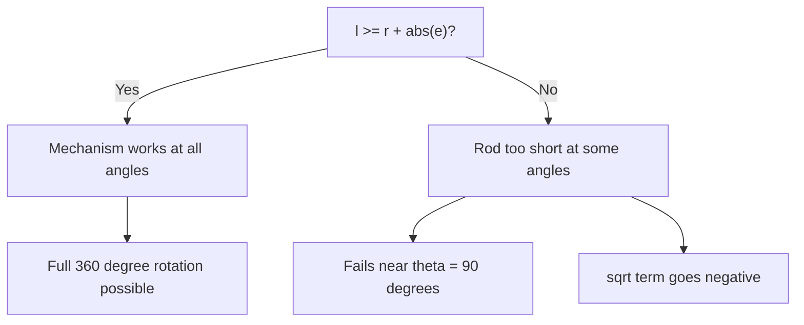

import TawkWidget from '../../../../components/TawkWidget.astro';
import UniversalContentContributors from '../../../../components/UniversalContentContributors.astro';
import InArticleAd from '../../../../components/InArticleAd.astro';
import Copyright from '../../../../components/Copyright.astro';
import BionicText from '../../../../components/BionicText.astro';
import TailwindWrapper from '../../../../components/TailwindWrapper.jsx';
import { Tabs, TabItem } from '@astrojs/starlight/components';
import { Card, CardGrid, Badge, Steps, LinkButton, FileTree } from '@astrojs/starlight/components';

<UniversalContentContributors 
  contributors={frontmatter.contributors}
/>


import MechanismDesignSimulationComments from '../../../../components/mechanism-design-simulation/MechanismDesignSimulationComments.astro';

You can memorize the crank-slider position equation and solve textbook problems perfectly, yet still be surprised by what happens when you change the offset from 0 to 20 mm. These experiments close that gap: you will predict, simulate, measure, and analyze, building the kind of intuition that separates someone who knows the formula from someone who understands the mechanism. #CrankSlider #MechanismDesign #EngineeringLab

:::tip[What you need]
Open the [Crank-Slider Mechanism Simulator](/product-development/crank-slider-mechanism-simulator/) in a separate browser tab. You will use it throughout all eight experiments. For data analysis, you need Python 3 with NumPy and Matplotlib.
:::

:::note[Related resources]
Want to build a 3D model of this mechanism? See the [Slider Crank Mechanism Design](/education/parametric-mechanical-cad-freecad/slider-crank-mechanism) lesson in our FreeCAD course. For a feature overview of the simulator, see the [2D Mechanisms Analyzer](/product-development/2d-mechanisms-analyzer/) page.
:::

## Key Terms

Before starting, familiarize yourself with these terms used throughout the experiments:

| Term | Meaning |
|------|---------|
| **r** | Crank length (mm), the rotating arm connected to the motor |
| **l** | Connecting rod length (mm), the link between crank and slider |
| **e** | Slider offset (mm), the perpendicular distance between the slider path and the crank pivot. Zero means the slider moves in line with the pivot. |
| **TDC** | Top Dead Center, the crank angle (0 degrees) where the slider reaches its maximum extension (crank and rod are collinear, stretched out) |
| **BDC** | Bottom Dead Center, the crank angle (180 degrees) where the slider reaches its minimum extension (crank folds back on rod) |
| **Stroke** | The total distance the slider travels between TDC and BDC, always equal to 2r |
| **l/r ratio** | Rod-to-crank ratio, a key design parameter. Typical mechanisms use values between 3 and 5 |
| **MA** | Mechanical advantage, the ratio of output force to input force. Varies continuously through the rotation cycle |
| **Transmission angle** | The angle between the connecting rod and the slider direction. Below about 40 degrees, force transmission becomes inefficient |
| **Quick-return** | Asymmetric motion caused by a non-zero offset, where the slider moves faster in one direction than the other |

### Experiment Workflow


## Setting Up Your Workspace

<InArticleAd />


Before starting the experiments, create a project folder to keep your data and scripts organized:

<FileTree>
- crank-slider-lab/
  - data/
    - exp1_baseline.csv
    - exp2_quick_return.csv
    - exp3_rod_ratio.csv
    - exp4_breaking.csv
    - exp5_dead_centers.csv
    - exp6_torque.csv
    - exp7_presets.csv
    - exp8_sensitivity.csv
  - plots/
  - scripts/
    - experiment_1_baseline.py
    - experiment_2_quick_return.py
    - experiment_3_rod_ratio.py
    - experiment_6_torque_analysis.py
    - experiment_8_sensitivity.py
</FileTree>

### How to Record Data

For each experiment, you have two options to collect data:

1. **Download CSV from the simulator** (recommended): The simulator's download section provides a complete CSV with 361 data points and 8 variables per row. This is the most accurate and complete dataset.

2. **Record from charts**: Read values by hovering over the charts at specific angles, then save as a CSV file matching the simulator's column format:

```text title="data/exp1_baseline.csv"
Crank Angle (deg),Displacement (mm),Velocity (mm/s),Acceleration (mm/s²),Mechanical Advantage,Rod Angle (deg),Transmission Angle (deg),Crank Torque (N*m)
0,200.00,0.00,-2631.89,0.0000,0.00,90.00,0.0000
30,186.60,-200.12,-1975.43,0.0265,9.59,80.41,-1.0530
```

The Python scripts load simulator CSV data and overlay it against analytical computations, so you can verify the simulator's accuracy and catch any discrepancies.

## Experiment 1: Baseline Kinematic Profile

<InArticleAd />


Most students can solve $x = r\cos\theta + \sqrt{l^2 - r^2\sin^2\theta}$ on paper, but they are often surprised that the velocity is not sinusoidal and that the acceleration at TDC is significantly larger than at BDC. Without seeing the full 360-degree profile, you cannot appreciate the asymmetry that exists even in a zero-offset mechanism. This experiment builds the reference you will compare every other experiment against.

:::note[Objective]
Verify the position equation against the simulator and observe the velocity/acceleration asymmetry that the position equation alone does not reveal.
:::

<Steps>
1. **Configure the simulator**
   Set r = 50 mm, l = 150 mm, e = 0 mm, speed = 60 RPM, slider force = 0 N.

2. **Predict**
   Before running the experiment, calculate by hand:
   - Position at $\theta$ = 0 (TDC): $x = r + l$ = ?
   - Position at $\theta$ = 180 (BDC): $x = l - r$ = ?
   - Stroke length: TDC - BDC = ?
   - Position at $\theta$ = 90: $x = \sqrt{l^2 - r^2}$ = ?

3. **Run the experiment**
   Click "Run Full Experiment". Record the values shown in the displacement summary panel (stroke length, max displacement, min displacement).

4. **Collect data**
   Hover over the displacement plot to read values at specific angles. Record the position at 0, 90, 180, and 270 degrees in the table below. Alternatively, you can download the CSV file from the simulator's download section for a complete dataset.

5. **Compare predictions with simulation**
   Do your hand calculations match the simulator output?
</Steps>

### Data Collection Table

| Parameter | Hand Calculation | Simulator Value | Error (%) |
|-----------|-----------------|-----------------|-----------|
| Position at TDC (mm) | | | |
| Position at BDC (mm) | | | |
| Stroke length (mm) | | | |
| Position at 90 degrees (mm) | | | |

### Python Analysis

```python title="experiment_1_baseline.py"
import numpy as np
import matplotlib.pyplot as plt
import csv
import os

# ============================================================
# STEP 1: Load CSV data from the simulator
# Download CSV from the simulator or record values from charts
# ============================================================
csv_file = 'data/exp1_baseline.csv'
sim_data = None

if os.path.exists(csv_file):
    with open(csv_file) as f:
        sim_data = list(csv.DictReader(f))
    print(f"Loaded {len(sim_data)} rows from {csv_file}")
else:
    print(f"No CSV found at {csv_file}. Using analytical data only.")
    print("To use simulator data: download CSV from the simulator or")
    print("record values from the charts into a CSV with columns:")
    print("Crank Angle (deg), Displacement (mm), Velocity (mm/s), Acceleration (mm/s²)")

# ============================================================
# STEP 2: Analytical computation
# ============================================================
r, l, e = 50, 150, 0
rpm = 60
omega = rpm * 2 * np.pi / 60

theta = np.arange(0, 361)
theta_rad = np.radians(theta)
sinT = np.sin(theta_rad)
cosT = np.cos(theta_rad)
S = r * sinT - e
Q = np.sqrt(l**2 - S**2)

x_anal = r * cosT + Q
v_anal = -r * omega * (sinT + cosT * S / Q)
a_anal = omega**2 * (-r*cosT + r*sinT*S/Q - r**2*cosT**2*l**2/Q**3)

# ============================================================
# STEP 3: Plot simulator data vs analytical
# ============================================================
fig, axes = plt.subplots(3, 1, figsize=(10, 8), sharex=True)

if sim_data:
    sim_angles = [float(row['Crank Angle (deg)']) for row in sim_data]
    sim_x = [float(row['Displacement (mm)']) for row in sim_data]
    sim_v = [float(row['Velocity (mm/s)']) for row in sim_data]
    sim_a = [float(row['Acceleration (mm/s²)']) for row in sim_data]

    axes[0].plot(sim_angles, sim_x, 'b-', label='Simulator', linewidth=2)
    axes[0].plot(theta, x_anal, 'r--', label='Analytical', linewidth=1)
    axes[1].plot(sim_angles, sim_v, 'g-', label='Simulator', linewidth=2)
    axes[1].plot(theta, v_anal, 'r--', label='Analytical', linewidth=1)
    axes[2].plot(sim_angles, sim_a, 'r-', label='Simulator', linewidth=2)
    axes[2].plot(theta, a_anal, 'b--', label='Analytical', linewidth=1)
    for ax in axes: ax.legend(fontsize=8)

    # Error report
    common = min(len(sim_x), len(x_anal))
    x_err = [abs(s - a) for s, a in zip(sim_x[:common], x_anal[:common])]
    v_err = [abs(s - a) for s, a in zip(sim_v[:common], v_anal[:common])]
    print(f"\nDisplacement: max error = {max(x_err):.4f} mm")
    print(f"Velocity: max error = {max(v_err):.4f} mm/s")
else:
    axes[0].plot(theta, x_anal, 'b-', linewidth=2)
    axes[1].plot(theta, v_anal, 'g-', linewidth=2)
    axes[2].plot(theta, a_anal, 'r-', linewidth=2)

axes[0].set_ylabel('Displacement (mm)')
axes[0].set_title('Experiment 1: Baseline Kinematic Profile (r=50, l=150, e=0)')
axes[1].set_ylabel('Velocity (mm/s)')
axes[1].axhline(y=0, color='k', linewidth=0.5)
axes[2].set_ylabel('Acceleration (mm/s^2)')
axes[2].set_xlabel('Crank Angle (degrees)')
axes[2].axhline(y=0, color='k', linewidth=0.5)

plt.tight_layout()
plt.savefig('plots/experiment_1_results.png', dpi=150)
plt.show()

print(f"\nTDC position (0 deg): {x_anal[0]:.2f} mm")
print(f"BDC position (180 deg): {x_anal[180]:.2f} mm")
print(f"Stroke: {x_anal.max() - x_anal.min():.2f} mm")
print(f"Position at 90 deg: {x_anal[90]:.2f} mm")
```

### Expected Results

- TDC position: 200.00 mm, BDC position: 100.00 mm, Stroke: 100.00 mm
- Position at 90 degrees: 141.42 mm
- Velocity is zero at TDC and BDC (dead centers), maximum near mid-stroke
- Acceleration is maximum (negative) at TDC and maximum (positive) at BDC
- Analytical and simulator values should match to at least 4 decimal places

## Experiment 2: The Quick-Return Effect (Offset)

<InArticleAd />


A shaper machine cuts metal on the forward stroke and returns the tool on the backward stroke. The return stroke does no useful work, so engineers want it to be faster: less idle time means higher productivity. But how do you make one direction faster than the other when the crank rotates at constant speed? The answer is offset. By shifting the slider path away from the crank pivot, the mechanism spends more crank rotation on one stroke than the other. This effect is invisible in the standard e=0 equation, and impossible to appreciate without seeing the velocity profiles side by side.

:::note[Objective]
Observe how offset creates asymmetric motion and quantify the quick-return ratio that determines shaper and press productivity.
:::

<Steps>
1. **Save baseline as Experiment A**
   With the baseline settings (r=50, l=150, e=0, 60 RPM), click "Save as Experiment A".

2. **Apply offset**
   Change offset to e = 20 mm. Click "Run Full Experiment".

3. **Observe the overlay**
   Both configurations now appear on every chart. Note how the velocity profile becomes asymmetric.

4. **Repeat with negative offset**
   Clear Experiment A. Save the current (e=20) as Experiment A. Change to e = -20 mm. Run the experiment.

5. **Switch to time domain**
   Click the "Time (s)" button in the x-axis picker. Observe how the slider spends different amounts of time on the forward vs return stroke.

6. **Collect data**
   For each offset value, read the max and min velocity from the velocity summary panel. In time domain, estimate the forward and return stroke durations from the displacement plot. Record in the table below and save as `data/exp2_quick_return.csv`. Alternatively, download the CSV from the simulator's download section for each configuration.
</Steps>

### Data Collection Table

| Measurement | e = 0 mm | e = 20 mm | e = -20 mm |
|-------------|----------|-----------|------------|
| Max velocity (mm/s) | | | |
| Min velocity (mm/s) | | | |
| Time for forward stroke (s) | | | |
| Time for return stroke (s) | | | |
| Quick-return ratio | | | |

### Python Analysis

```python title="experiment_2_quick_return.py"
import numpy as np
import matplotlib.pyplot as plt
import csv
import os

# ============================================================
# STEP 1: Load CSV data from the simulator
# Run at e=0, e=20, e=-20, download CSV for each
# ============================================================
csv_files = {
    'e=0': 'data/exp2_e0.csv',
    'e=20': 'data/exp2_e20.csv',
    'e=-20': 'data/exp2_e-20.csv',
}
sim_datasets = {}
for label, path in csv_files.items():
    if os.path.exists(path):
        with open(path) as f:
            sim_datasets[label] = list(csv.DictReader(f))
        print(f"Loaded {len(sim_datasets[label])} rows for {label}")
    else:
        print(f"No CSV at {path} (analytical only for {label})")

# ============================================================
# STEP 2: Analytical computation
# ============================================================
r, l, rpm = 50, 150, 60
omega = rpm * 2 * np.pi / 60
theta = np.arange(0, 361)
theta_rad = np.radians(theta)

# ============================================================
# STEP 3: Plot simulator data vs analytical
# ============================================================
fig, axes = plt.subplots(2, 1, figsize=(10, 6), sharex=True)

for e, color, label in [(0, 'blue', 'e=0'), (20, 'red', 'e=20'), (-20, 'green', 'e=-20')]:
    S = r * np.sin(theta_rad) - e
    Q = np.sqrt(l**2 - S**2)
    x_anal = r * np.cos(theta_rad) + Q
    v_anal = -r * omega * (np.sin(theta_rad) + np.cos(theta_rad) * S / Q)

    if label in sim_datasets:
        sim = sim_datasets[label]
        sim_angles = [float(row['Crank Angle (deg)']) for row in sim]
        sim_x = [float(row['Displacement (mm)']) for row in sim]
        sim_v = [float(row['Velocity (mm/s)']) for row in sim]
        axes[0].plot(sim_angles, sim_x, '-', color=color,
                     label=f'{label} (sim)', linewidth=2)
        axes[0].plot(theta, x_anal, '--', color=color,
                     label=f'{label} (anal)', linewidth=1, alpha=0.6)
        axes[1].plot(sim_angles, sim_v, '-', color=color,
                     label=f'{label} (sim)', linewidth=2)
        axes[1].plot(theta, v_anal, '--', color=color,
                     label=f'{label} (anal)', linewidth=1, alpha=0.6)
        # Quick-return: max vs min velocity magnitude
        vmax = max(sim_v)
        vmin = min(sim_v)
        print(f"{label}: max v = {vmax:.2f}, min v = {vmin:.2f}, ratio = {abs(vmin/vmax):.3f}")
    else:
        axes[0].plot(theta, x_anal, color=color, label=label, linewidth=2)
        axes[1].plot(theta, v_anal, color=color, label=label, linewidth=2)

axes[0].set_ylabel('Displacement (mm)')
axes[0].legend(fontsize=8)
axes[0].set_title('Experiment 2: Quick-Return Effect')
axes[1].set_ylabel('Velocity (mm/s)')
axes[1].set_xlabel('Crank Angle (degrees)')
axes[1].axhline(y=0, color='k', linewidth=0.5)
axes[1].legend(fontsize=8)

plt.tight_layout()
plt.savefig('plots/experiment_2_quick_return.png', dpi=150)
plt.show()
```

### Design Question

A shaper machine needs the cutting stroke to be 1.5 times slower than the return stroke (quick-return ratio of 1.5). With r = 50 mm and l = 150 mm, what offset value would you need? Use the simulator to find it experimentally by adjusting e and checking the time-domain velocity plot.

## Experiment 3: Rod-to-Crank Ratio and Smoothness

<InArticleAd />


Every textbook states "use an l/r ratio between 3 and 5" as a design rule. But why? What actually goes wrong at l/r = 2 or l/r = 1.5? The answer involves three things happening simultaneously: acceleration spikes become severe (meaning higher inertia forces on bearings), the connecting rod swings through dangerously large angles (increasing side loads on the slider), and the transmission angle drops toward the zone where the mechanism jams under load. No single equation shows all three effects together. Only by sweeping the ratio and watching all the charts change at once can you see why the rule exists and where the real boundaries are.

:::note[Objective]
Discover why real mechanisms use l/r between 3 and 5 by observing the simultaneous degradation of acceleration, rod angle, and transmission angle at low ratios.
:::

<Steps>
1. **Low ratio (l/r = 2)**
   Set r = 50 mm, l = 100 mm, e = 0 mm, 60 RPM. Run the experiment. Note the acceleration peaks and the rod angle range.

2. **Save as Experiment A**

3. **High ratio (l/r = 4)**
   Set r = 50 mm, l = 200 mm. Run the experiment.

4. **Compare the overlaid charts**
   Focus on: acceleration magnitude, connecting rod angle range, and transmission angle minimum.

5. **Try l/r = 1.5**
   Set r = 50 mm, l = 75 mm. This is below the typical design range. Observe the extreme angles and acceleration spikes.

6. **Collect data**
   For each ratio, read peak acceleration, max rod angle, and min transmission angle from the summary panels. Record in the table and save as `data/exp3_rod_ratio.csv`. Alternatively, download the CSV from the simulator for each configuration.
</Steps>

### Data Collection Table

| Measurement | l/r = 1.5 | l/r = 2 | l/r = 3 | l/r = 4 |
|-------------|-----------|---------|---------|---------|
| Peak acceleration (mm/s^2) | | | | |
| Max rod angle (degrees) | | | | |
| Min transmission angle (degrees) | | | | |
| Rod/crank warning? | | | | |

### Python Analysis

```python title="experiment_3_rod_ratio.py"
import numpy as np
import matplotlib.pyplot as plt
import csv
import os

# ============================================================
# STEP 1: Load CSV data from the simulator
# Run at l/r = 1.5, 2, 3, 4 (r=50), download CSV for each
# ============================================================
csv_files = {
    1.5: 'data/exp3_ratio_1.5.csv',
    2: 'data/exp3_ratio_2.csv',
    3: 'data/exp3_ratio_3.csv',
    4: 'data/exp3_ratio_4.csv',
}
sim_datasets = {}
for ratio, path in csv_files.items():
    if os.path.exists(path):
        with open(path) as f:
            sim_datasets[ratio] = list(csv.DictReader(f))
        print(f"Loaded {len(sim_datasets[ratio])} rows for l/r={ratio}")
    else:
        print(f"No CSV at {path} (analytical only for l/r={ratio})")

# ============================================================
# STEP 2: Analytical computation
# ============================================================
r = 50
omega = 60 * 2 * np.pi / 60
theta = np.arange(0, 361)
theta_rad = np.radians(theta)
ratios = [1.5, 2, 3, 4, 5]

# ============================================================
# STEP 3: Plot simulator data vs analytical
# ============================================================
fig, axes = plt.subplots(3, 1, figsize=(10, 9), sharex=True)
colors = ['red', 'orange', 'blue', 'green', 'purple']

for i, ratio in enumerate(ratios):
    l = r * ratio
    sinT = np.sin(theta_rad)
    cosT = np.cos(theta_rad)
    S = r * sinT
    Q = np.sqrt(l**2 - S**2)
    a_anal = omega**2 * (-r*cosT + r*sinT*S/Q - r**2*cosT**2*l**2/Q**3)
    rod_anal = np.degrees(np.arcsin(S / l))
    trans_anal = np.degrees(np.arccos(np.clip(Q / l, -1, 1)))

    label = f'l/r={ratio}'
    if ratio in sim_datasets:
        sim = sim_datasets[ratio]
        sim_angles = [float(row['Crank Angle (deg)']) for row in sim]
        sim_accel = [float(row['Acceleration (mm/s²)']) for row in sim]
        sim_rod = [float(row['Rod Angle (deg)']) for row in sim]
        sim_trans = [float(row['Transmission Angle (deg)']) for row in sim]
        axes[0].plot(sim_angles, sim_accel, '-', color=colors[i],
                     label=f'{label} (sim)', linewidth=2)
        axes[0].plot(theta, a_anal, '--', color=colors[i], linewidth=1, alpha=0.5)
        axes[1].plot(sim_angles, sim_rod, '-', color=colors[i],
                     label=f'{label} (sim)', linewidth=2)
        axes[2].plot(sim_angles, sim_trans, '-', color=colors[i],
                     label=f'{label} (sim)', linewidth=2)
        print(f"l/r={ratio}: peak accel (sim) = {max(abs(a) for a in sim_accel):.1f} mm/s^2")
    else:
        axes[0].plot(theta, a_anal, color=colors[i], label=label, linewidth=1.5)
        axes[1].plot(theta, rod_anal, color=colors[i], label=label, linewidth=1.5)
        axes[2].plot(theta, trans_anal, color=colors[i], label=label, linewidth=1.5)

axes[0].set_ylabel('Acceleration (mm/s^2)')
axes[0].set_title('Experiment 3: Effect of Rod-to-Crank Ratio')
axes[0].legend(fontsize=8)
axes[1].set_ylabel('Rod Angle (degrees)')
axes[1].legend(fontsize=8)
axes[2].set_ylabel('Transmission Angle (degrees)')
axes[2].set_xlabel('Crank Angle (degrees)')
axes[2].axhline(y=40, color='r', linestyle='--', linewidth=0.8, label='40 deg limit')
axes[2].legend(fontsize=8)

plt.tight_layout()
plt.savefig('plots/experiment_3_rod_ratio.png', dpi=150)
plt.show()
```

### Expected Results

- Higher l/r ratios produce smoother acceleration profiles (closer to pure sinusoidal)
- At l/r = 1.5, the rod angle exceeds 40 degrees and the mechanism is impractical
- The simulator should display a rod/crank warning at l/r below 2.0

## Experiment 4: Breaking the Mechanism

<InArticleAd />


In a real workshop, building a mechanism with a connecting rod shorter than the crank would waste material, time, and possibly injure someone when it locks up mid-cycle. In the simulator, you can break mechanisms for free and learn exactly why they fail. This experiment shows you the geometric limit that every crank-slider must satisfy: the rod must be long enough to reach the slider at every crank angle. You will find the exact angle where the mechanism becomes impossible and derive the constraint from first principles. This is knowledge that prevents costly design errors before they reach the shop floor.

:::note[Objective]
Find the geometric constraint that separates a working mechanism from an impossible one, and observe the failure at the exact angle.
:::

<Steps>
1. **Start with a working mechanism**
   Set r = 50 mm, l = 150 mm, e = 0. Run the experiment. Everything works.

2. **Gradually reduce the rod**
   Change l to 100 mm (l = 2r, barely works). Run and observe.

3. **Make l shorter than r**
   Set l = 40 mm (l is less than r). Run the experiment.

4. **Observe the animation**
   Start the animation. At what angle does the mechanism stop working? The connecting rod is too short to reach the slider.

5. **Add offset and test the constraint**
   Set r = 50 mm, l = 80 mm, e = 30 mm. The constraint is l must be greater than or equal to r + |e|. Here 80 is less than 50 + 30 = 80. Test at exactly l = 80 and l = 79.

6. **Collect data**
   For each configuration, note whether the experiment completes a full 360 degrees and at what angle (if any) it fails. Save as `data/exp4_breaking.csv` with columns: r, l, e, works (yes/no), fail_angle.
</Steps>

The geometric constraint determines whether the connecting rod can reach the slider at every crank angle. The worst case is when the crank points straight up (theta = 90 degrees), maximizing the vertical distance the rod must span:



### Data Collection Table

| Configuration | Works? | Fails at angle? | l vs r + abs(e) |
|---------------|--------|-----------------|-------------------------------|
| r=50, l=150, e=0 | | | |
| r=50, l=50, e=0 | | | |
| r=50, l=40, e=0 | | | |
| r=50, l=80, e=30 | | | |
| r=50, l=79, e=30 | | | |

### Analysis Question

Derive the geometric constraint mathematically. Starting from the position equation:

$$x = r\cos\theta + \sqrt{l^2 - (r\sin\theta - e)^2}$$

For the mechanism to work at all angles, what must be true about the term under the square root? At what crank angle is the constraint most critical?

### Expected Results

- The constraint is $l \geq r + |e|$
- Failure occurs when $r\sin\theta - e$ exceeds $l$ in magnitude
- The critical angle is $\theta = 90$ degrees (for e = 0), where $r\sin\theta$ is maximized
- With offset, the critical angle shifts

## Experiment 5: Dead Centers and Mechanical Advantage

<InArticleAd />


At two specific positions in every crank-slider cycle, the slider velocity drops to zero and the mechanical advantage spikes toward infinity. These are the dead centers, and they are simultaneously the most dangerous and the most useful positions in the mechanism. Dangerous because the mechanism can stall if it stops exactly at a dead center (there is zero torque to restart it). Useful because machines like toggle clamps, coining presses, and injection molding machines are deliberately designed to do their work at dead center, where the force multiplication is highest. You cannot appreciate this duality from an equation; you need to watch the mechanism crawl near dead center and race through mid-stroke to feel the difference.

:::note[Objective]
Observe the dead center singularities in velocity, MA, and torque, and understand why machines exploit or avoid these positions.
:::

<Steps>
1. **Configure**
   Set r = 50 mm, l = 150 mm, e = 0 mm, speed = 30 RPM (slow for observation), slider force = 500 N.

2. **Run the experiment**
   Focus on the mechanical advantage chart and the crank torque chart.

3. **Observe the animation**
   Start the animation at low speed. Enable the crank path (locus). Watch the slider crawl near TDC and BDC, then race through mid-stroke.

4. **Pause at TDC (0 degrees)**
   Use the manual angle control. Set to 0 degrees. Read the mechanical advantage value. What happens to crank torque?

5. **Sweep through dead center**
   Slowly move from 350 degrees to 10 degrees. Watch MA spike and torque pass through zero.

6. **Collect data**
   Use the manual angle control to set each angle in the table. Read displacement from the animation labels, velocity and torque from the charts (hover at the corresponding angle), and MA from the mechanical advantage summary. Save as `data/exp5_dead_centers.csv`. Alternatively, download the CSV from the simulator.
</Steps>

At dead centers, the crank and connecting rod become collinear:

```text
    TDC (theta = 0):                   BDC (theta = 180):

    O----r----+========l========[S]    [S]========l========+----r----O
    pivot     crank end         slider  slider         crank end    pivot
              (max extension)                          (min extension)

    velocity = 0, MA --> infinity      velocity = 0, MA --> infinity
```

### Data Collection Table

| Angle | Displacement (mm) | Velocity (mm/s) | MA | Torque (Nm) |
|-------|-------------------|------------------|----|-------------|
| 0 (TDC) | | | | |
| 30 | | | | |
| 60 | | | | |
| 90 | | | | |
| 120 | | | | |
| 150 | | | | |
| 180 (BDC) | | | | |

### Python Analysis

```python title="experiment_5_dead_centers.py"
import numpy as np
import matplotlib.pyplot as plt
import csv
import os

# ============================================================
# STEP 1: Load CSV data from the simulator
# ============================================================
csv_file = 'data/exp5_dead_centers.csv'
sim_data = None
if os.path.exists(csv_file):
    with open(csv_file) as f:
        sim_data = list(csv.DictReader(f))
    print(f"Loaded {len(sim_data)} rows from {csv_file}")
else:
    print(f"No CSV at {csv_file}. Using analytical data only.")

# ============================================================
# STEP 2: Analytical computation
# ============================================================
r, l, e = 50, 150, 0
rpm = 30
omega = rpm * 2 * np.pi / 60
F = 500  # N

theta = np.arange(0, 361)
theta_rad = np.radians(theta)
sinT = np.sin(theta_rad)
cosT = np.cos(theta_rad)
S = r * sinT - e
Q = np.sqrt(l**2 - S**2)

x_anal = r * cosT + Q
v_anal = -r * omega * (sinT + cosT * S / Q)
dxdtheta = r * (sinT + cosT * S / Q)
ma_anal = np.where(np.abs(dxdtheta) > 0.001, 1 / np.abs(dxdtheta), 0)
torque_anal = F * (v_anal / 1000) / omega

# ============================================================
# STEP 3: Plot simulator data vs analytical
# ============================================================
fig, axes = plt.subplots(3, 1, figsize=(10, 9), sharex=True)

if sim_data:
    sim_angles = [float(row['Crank Angle (deg)']) for row in sim_data]
    sim_v = [float(row['Velocity (mm/s)']) for row in sim_data]
    sim_ma = [float(row['Mechanical Advantage']) for row in sim_data]
    sim_torque = [float(row['Crank Torque (N*m)']) for row in sim_data]
    axes[0].plot(sim_angles, sim_v, 'g-', label='Simulator', linewidth=2)
    axes[0].plot(theta, v_anal, 'r--', label='Analytical', linewidth=1)
    axes[1].plot(sim_angles, sim_ma, 'm-', label='Simulator', linewidth=2)
    axes[1].plot(theta, ma_anal, 'r--', label='Analytical', linewidth=1)
    axes[2].plot(sim_angles, sim_torque, 'r-', label='Simulator', linewidth=2)
    axes[2].plot(theta, torque_anal, 'b--', label='Analytical', linewidth=1)
    for ax in axes: ax.legend(fontsize=8)
else:
    axes[0].plot(theta, v_anal, 'g-', linewidth=2)
    axes[1].plot(theta, ma_anal, 'm-', linewidth=2)
    axes[2].plot(theta, torque_anal, 'r-', linewidth=2)

axes[0].set_ylabel('Velocity (mm/s)')
axes[0].axhline(y=0, color='k', linewidth=0.5)
axes[0].axvline(x=0, color='r', linestyle='--', alpha=0.5, label='TDC')
axes[0].axvline(x=180, color='b', linestyle='--', alpha=0.5, label='BDC')
axes[0].set_title('Experiment 5: Dead Centers (r=50, l=150, F=500N, 30 RPM)')
axes[1].set_ylabel('Mechanical Advantage')
axes[1].set_ylim(0, 0.15)
axes[2].set_ylabel('Crank Torque (Nm)')
axes[2].set_xlabel('Crank Angle (degrees)')
axes[2].axhline(y=0, color='k', linewidth=0.5)

plt.tight_layout()
plt.savefig('plots/experiment_5_dead_centers.png', dpi=150)
plt.show()

for angle in [0, 30, 60, 90, 120, 150, 180]:
    print(f"theta={angle:3d}: x={x_anal[angle]:.2f} mm, v={v_anal[angle]:.2f} mm/s, "
          f"MA={ma_anal[angle]:.4f}, T={torque_anal[angle]:.4f} Nm")
```

### Design Question

A coining press needs maximum force at the bottom of its stroke. Should the pressing action happen at TDC, BDC, or mid-stroke? Why? What does this tell you about where to position the workpiece relative to the dead center?

## Experiment 6: Force Analysis and Motor Sizing

<InArticleAd />


An electric motor delivers roughly constant torque. A crank-slider mechanism demands wildly varying torque through its cycle. This mismatch is the reason every reciprocating engine, compressor, and pump has a flywheel. But how big should that flywheel be? The answer depends on how much the torque varies, which depends on the slider force, the speed, and the geometry. Without computing the full torque curve and integrating the energy fluctuation, you are guessing at flywheel size. This experiment gives you the torque data to make that calculation properly.

:::note[Objective]
Compute full-cycle torque curves at different speeds and forces, and estimate the energy fluctuation that determines flywheel sizing.
:::

<Steps>
1. **Low force, low speed**
   Set r = 50 mm, l = 150 mm, e = 0 mm, speed = 30 RPM, slider force = 200 N. Run the experiment. Note the peak crank torque.

2. **Save as Experiment A**

3. **Same force, higher speed**
   Change speed to 120 RPM. Run the experiment. Compare the torque curves.

4. **Higher force**
   Clear Experiment A. Set F = 800 N, speed = 30 RPM. Save as Experiment A. Then set F = 800 N, speed = 120 RPM. Run and compare.

5. **Record your data**
   Fill in the data collection table below by reading values from the chart summary panels. Save your recordings as a CSV file (columns: configuration, max_velocity, min_velocity, peak_torque) for Python analysis.
</Steps>

### Python Analysis

```python title="experiment_6_torque_analysis.py"
import numpy as np
import matplotlib.pyplot as plt
import csv
import os

# ============================================================
# STEP 1: Load CSV data from the simulator
# Run at 30, 60, 120 RPM with F=500N, download CSV for each
# ============================================================
csv_files = {
    '30 RPM': 'data/exp6_30rpm.csv',
    '60 RPM': 'data/exp6_60rpm.csv',
    '120 RPM': 'data/exp6_120rpm.csv',
}
sim_datasets = {}
for label, path in csv_files.items():
    if os.path.exists(path):
        with open(path) as f:
            sim_datasets[label] = list(csv.DictReader(f))
        print(f"Loaded {len(sim_datasets[label])} rows for {label}")
    else:
        print(f"No CSV at {path} (analytical only for {label})")

# ============================================================
# STEP 2: Analytical computation + STEP 3: Plot comparison
# ============================================================
r, l, e = 50, 150, 0
F = 500  # N

fig, ax = plt.subplots(figsize=(10, 5))
rpm_colors = {'30 RPM': 'blue', '60 RPM': 'green', '120 RPM': 'red'}

for rpm, color in [(30, 'blue'), (60, 'green'), (120, 'red')]:
    omega = rpm * 2 * np.pi / 60
    theta = np.arange(0, 361)
    theta_rad = np.radians(theta)
    sinT = np.sin(theta_rad)
    cosT = np.cos(theta_rad)
    S = r * sinT - e
    Q = np.sqrt(l**2 - S**2)
    v_anal = -r * omega * (sinT + cosT * S / Q)
    torque_anal = F * (v_anal / 1000) / omega

    label = f'{rpm} RPM'
    if label in sim_datasets:
        sim = sim_datasets[label]
        sim_angles = [float(row['Crank Angle (deg)']) for row in sim]
        sim_torque = [float(row['Crank Torque (N*m)']) for row in sim]
        ax.plot(sim_angles, sim_torque, '-', color=color,
                label=f'{label} (simulator)', linewidth=2)
        ax.plot(theta, torque_anal, '--', color=color,
                label=f'{label} (analytical)', linewidth=1, alpha=0.6)
        peak_sim = max(abs(t) for t in sim_torque)
        print(f"{label}: peak torque (sim) = {peak_sim:.4f} Nm")
    else:
        ax.plot(theta, torque_anal, color=color, label=label, linewidth=2)

    energy = np.trapz(np.abs(torque_anal), np.radians(theta))
    print(f"{label}: peak torque (anal) = {np.max(np.abs(torque_anal)):.4f} Nm, "
          f"energy/cycle = {energy:.4f} J")

ax.set_xlabel('Crank Angle (degrees)')
ax.set_ylabel('Crank Torque (Nm)')
ax.set_title(f'Experiment 6: Crank Torque vs Speed (F={F}N, r={r}, l={l})')
ax.axhline(y=0, color='k', linewidth=0.5)
ax.legend(fontsize=8)
plt.tight_layout()
plt.savefig('plots/experiment_6_torque.png', dpi=150)
plt.show()
```

### Design Question

The torque curve shows large variations through the cycle. A motor delivering constant torque would alternately accelerate and decelerate the crank. How would you size a flywheel to smooth this out? The energy stored in a flywheel is $E = \frac{1}{2}I\omega^2$. From your torque data, estimate the energy fluctuation per cycle.

## Experiment 7: Comparing Presets (Real Applications)

<InArticleAd />


An IC engine, an air compressor, and a hydraulic press are all crank-slider mechanisms. Yet they look different, run at different speeds, and have different proportions. Why? Because each machine optimizes for something different: the engine wants smooth, balanced, high-speed motion; the compressor wants efficient compression at moderate speed; the press wants maximum force at low speed with a quick return. By overlaying their kinematic profiles on the same charts, you can see exactly how the same four parameters (r, l, e, speed) create three fundamentally different machines. This is design thinking: understanding which parameter serves which purpose.

:::note[Objective]
Compare three real-world applications side by side and identify which parameter choices serve which engineering goals.
:::

<Steps>
1. **IC Engine preset**
   Select the IC Engine preset (r=40, l=160, e=0, 60 RPM, F=500 N). Run the experiment. Save as Experiment A.

2. **Hydraulic Press preset**
   Select the Hydraulic Press preset (r=60, l=180, e=10, 30 RPM, F=800 N). Run the experiment.

3. **Compare the overlaid charts**
   Note the differences in velocity profiles (symmetry vs asymmetry), acceleration peaks, and torque curves.

4. **Air Compressor preset**
   Clear Experiment A. Select Air Compressor (r=30, l=120, e=0, 90 RPM, F=200 N). Compare with the previous two.

5. **Collect data**
   For each preset, read the stroke, peak velocity, peak acceleration, and peak torque from the summary panels. Calculate the l/r ratio by hand. Record in the table and save as `data/exp7_presets.csv`. Alternatively, download the CSV from the simulator for each preset.
</Steps>

### Data Collection Table

| Measurement | IC Engine | Air Compressor | Hydraulic Press |
|-------------|-----------|----------------|-----------------|
| Stroke (mm) | | | |
| l/r ratio | | | |
| Peak velocity (mm/s) | | | |
| Peak acceleration (mm/s^2) | | | |
| Peak torque (Nm) | | | |
| Quick-return ratio | | | |

### Analysis Question

Why does the hydraulic press have an offset but the IC engine doesn't? Think about what each machine optimizes for: the engine wants symmetric, balanced motion at high speed; the press wants asymmetric motion with a slow power stroke and fast return.

## Experiment 8: Parametric Sensitivity Study

<InArticleAd />


When a mechanism fails in service, it is usually because the inertia forces exceeded what the bearings or connecting rod could handle. Peak acceleration is the single number that determines inertia loading. But which design parameter has the strongest effect on it? If you need to reduce peak acceleration by 50%, should you shorten the crank, lengthen the rod, or slow down the motor? The answer is not intuitive: acceleration scales with the *square* of speed, meaning that doubling the RPM quadruples the peak acceleration. This experiment quantifies the sensitivity to each parameter, giving you the data to make rational design trade-offs instead of guessing.

:::note[Objective]
Quantify how crank length, rod length, and speed each affect peak acceleration, and identify which parameter dominates.
:::

<Steps>
1. **Baseline**
   Set r = 50 mm, l = 150 mm, e = 0 mm, speed = 60 RPM. Record peak acceleration.

2. **Vary crank length**
   Change r to 40, 50, 60, 70 mm (keep l = 150, e = 0, 60 RPM). Record peak acceleration for each.

3. **Vary rod length**
   Reset r = 50. Change l to 100, 125, 150, 175, 200 mm. Record peak acceleration for each.

4. **Vary speed**
   Reset l = 150. Change speed to 30, 60, 90, 120 RPM. Record peak acceleration for each.

5. **Record your data**
   For each configuration, read the peak acceleration from the summary panel and record it in the table below. Save as a CSV file (columns: parameter_name, value, peak_acceleration) for the Python analysis.
</Steps>

### Python Analysis

```python title="experiment_8_sensitivity.py"
import numpy as np
import matplotlib.pyplot as plt
import csv
import os

# ============================================================
# STEP 1: Load CSV data from the simulator
# Run for each parameter variation, download CSV
# Name files: exp8_r30.csv, exp8_l100.csv, exp8_rpm30.csv, etc.
# ============================================================
csv_dir = 'data'
sim_r, sim_l, sim_rpm = {}, {}, {}

for r_val in [30, 40, 50, 60, 70]:
    path = os.path.join(csv_dir, f'exp8_r{r_val}.csv')
    if os.path.exists(path):
        with open(path) as f:
            rows = list(csv.DictReader(f))
        accels = [abs(float(row['Acceleration (mm/s²)'])) for row in rows]
        sim_r[r_val] = max(accels)

for l_val in [100, 125, 150, 175, 200]:
    path = os.path.join(csv_dir, f'exp8_l{l_val}.csv')
    if os.path.exists(path):
        with open(path) as f:
            rows = list(csv.DictReader(f))
        accels = [abs(float(row['Acceleration (mm/s²)'])) for row in rows]
        sim_l[l_val] = max(accels)

for rpm_val in [30, 60, 90, 120]:
    path = os.path.join(csv_dir, f'exp8_rpm{rpm_val}.csv')
    if os.path.exists(path):
        with open(path) as f:
            rows = list(csv.DictReader(f))
        accels = [abs(float(row['Acceleration (mm/s²)'])) for row in rows]
        sim_rpm[rpm_val] = max(accels)

loaded = len(sim_r) + len(sim_l) + len(sim_rpm)
print(f"Loaded simulator data for {loaded} configurations")
if loaded == 0:
    print("No CSV files found. Using analytical data only.")

# ============================================================
# STEP 2: Analytical computation
# ============================================================
theta_rad = np.radians(np.arange(0, 361))

def peak_accel(r, l, e, rpm):
    omega = rpm * 2 * np.pi / 60
    sinT = np.sin(theta_rad)
    cosT = np.cos(theta_rad)
    S = r * sinT - e
    Q = np.sqrt(l**2 - S**2)
    a = omega**2 * (-r*cosT + r*sinT*S/Q - r**2*cosT**2*l**2/Q**3)
    return np.max(np.abs(a))

# ============================================================
# STEP 3: Plot simulator data vs analytical
# ============================================================
r_values = np.arange(20, 75, 5)
a_r = [peak_accel(r, 150, 0, 60) for r in r_values]
l_values = np.arange(80, 220, 10)
a_l = [peak_accel(50, l, 0, 60) for l in l_values]
rpm_values = np.arange(20, 150, 10)
a_rpm = [peak_accel(50, 150, 0, rpm) for rpm in rpm_values]

fig, axes = plt.subplots(1, 3, figsize=(14, 4))

axes[0].plot(r_values, a_r, 'b-', label='Analytical', linewidth=2)
if sim_r:
    sr_x = sorted(sim_r.keys())
    axes[0].plot(sr_x, [sim_r[k] for k in sr_x], 'ro', label='Simulator', markersize=8)
    axes[0].legend(fontsize=8)
axes[0].set_xlabel('Crank Length r (mm)')
axes[0].set_ylabel('Peak |Acceleration| (mm/s^2)')
axes[0].set_title('Sensitivity to r')

axes[1].plot(l_values, a_l, 'r-', label='Analytical', linewidth=2)
if sim_l:
    sl_x = sorted(sim_l.keys())
    axes[1].plot(sl_x, [sim_l[k] for k in sl_x], 'bo', label='Simulator', markersize=8)
    axes[1].legend(fontsize=8)
axes[1].set_xlabel('Rod Length l (mm)')
axes[1].set_title('Sensitivity to l')

axes[2].plot(rpm_values, a_rpm, 'g-', label='Analytical', linewidth=2)
if sim_rpm:
    srpm_x = sorted(sim_rpm.keys())
    axes[2].plot(srpm_x, [sim_rpm[k] for k in srpm_x], 'mo', label='Simulator', markersize=8)
    axes[2].legend(fontsize=8)
axes[2].set_xlabel('Speed (RPM)')
axes[2].set_title('Sensitivity to RPM')

plt.suptitle('Experiment 8: Parametric Sensitivity of Peak Acceleration')
plt.tight_layout()
plt.savefig('plots/experiment_8_sensitivity.png', dpi=150)
plt.show()

print("Key finding: acceleration scales with omega^2 (quadratic with speed)")
print(f"Doubling speed 60->120 RPM: {peak_accel(50,150,0,120)/peak_accel(50,150,0,60):.1f}x increase")
```

### Expected Results

- Peak acceleration scales linearly with crank length r
- Peak acceleration decreases with increasing rod length l (diminishing returns above l/r = 4)
- Peak acceleration scales with the **square** of speed (doubling RPM quadruples peak acceleration)
- Speed is the dominant parameter: this is why high-RPM engines face severe inertia loads

### Design Question

You are designing a mechanism that must keep peak acceleration below 5000 mm/s^2. Using your sensitivity data, what combinations of r, l, and RPM satisfy this constraint? Is there a single "best" design, or is it a trade-off?

## Writing Your Lab Report

<InArticleAd />


After completing all experiments, compile your findings into a lab report:

1. State the objective of each experiment and the parameters you used
2. Present your data collection tables with the values you recorded from the simulator
3. Include the plots generated by the Python scripts as figures
4. For each experiment, compare your hand-calculated predictions with the simulator values and discuss any discrepancies
5. Answer the design questions, referencing specific data from your experiments

The simulator also includes a downloadable report template and design specification in the downloads section, which can serve as a starting point.

For a complete discussion of the simulator's capabilities, see the [2D Mechanisms Analyzer](/product-development/2d-mechanisms-analyzer/) product page.

To build a physical 3D model of the mechanism you analyzed, follow the [Slider Crank Mechanism Design](/education/parametric-mechanical-cad-freecad/slider-crank-mechanism) lesson using FreeCAD.

<MechanismDesignSimulationComments />


<InArticleAd />
<TawkWidget />
<Copyright />