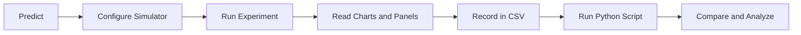

import TawkWidget from '../../../../components/TawkWidget.astro';
import UniversalContentContributors from '../../../../components/UniversalContentContributors.astro';
import InArticleAd from '../../../../components/InArticleAd.astro';
import Copyright from '../../../../components/Copyright.astro';
import BionicText from '../../../../components/BionicText.astro';
import TailwindWrapper from '../../../../components/TailwindWrapper.jsx';
import { Tabs, TabItem } from '@astrojs/starlight/components';
import { Card, CardGrid, Badge, Steps, LinkButton, FileTree } from '@astrojs/starlight/components';

<UniversalContentContributors
  contributors={frontmatter.contributors}
/>


import MechanismDesignSimulationComments from '../../../../components/mechanism-design-simulation/MechanismDesignSimulationComments.astro';

Every mechanism textbook presents the Grashof condition as a simple inequality: s + l must be less than or equal to p + q. Students memorize it, apply it on exams, and move on. But what does it actually look like when a mechanism transitions from Grashof to non-Grashof? What happens to the transmission angle, the velocity ratios, the coupler curve? These experiments let you see, measure, and analyze the behaviors that the inequality alone cannot convey. #FourBarLinkage #GrashofCondition #MechanismDesign

:::tip[What you need]
Open the [Four-Bar Linkage Simulator](/product-development/four-bar-linkage-simulator/) in a separate browser tab. You will use it throughout all six experiments. For data analysis, you need Python 3 with NumPy and Matplotlib.
:::

:::note[Related resources]
Want to build a 3D model of this mechanism? See the [Four-Bar Linkage Mechanism Design](/education/parametric-mechanical-cad-freecad/four-bar-linkage-mechanism) lesson in our FreeCAD course. For the crank-slider experiments, see [Lesson 1](/education/mechanism-design-simulation/crank-slider-experiments). For a feature overview, see the [2D Mechanisms Analyzer](/product-development/2d-mechanisms-analyzer/) page.
:::

## Key Terms

| Term | Meaning |
|------|---------|
| **a** | Input crank length (mm), the driven link |
| **b** | Coupler length (mm), the floating link connecting the two moving joints |
| **c** | Follower/rocker length (mm), the output link |
| **d** | Ground/frame length (mm), the fixed distance between the two pivot points |
| **Grashof** | A linkage where s + l is at most p + q (s = shortest, l = longest, p and q = remaining). At least one link can make a full rotation |
| **Crank-rocker** | Grashof linkage where the shortest link is the input: it rotates fully while the output oscillates |
| **Double-crank** | Grashof linkage where the shortest link is the ground: both input and output rotate fully |
| **Double-rocker** | Either non-Grashof (no full rotation) or Grashof with the coupler as shortest link |
| **Transmission angle** | The angle between the coupler and follower. Below about 40 degrees, force transmission becomes poor |
| **Coupler curve** | The path traced by a point on the coupler link as the mechanism moves |
| **Circuit** | The two possible assembly configurations (open and crossed) for the same link lengths |

### Experiment Workflow



## Setting Up Your Workspace

<FileTree>
- four-bar-lab/
  - data/
    - exp1_grashof.csv
    - exp2_transmission.csv
    - exp3_presets.csv
    - exp4_circuits.csv
    - exp5_coupler.csv
    - exp6_sensitivity.csv
  - plots/
  - scripts/
    - experiment_1_grashof.py
    - experiment_2_transmission.py
    - experiment_3_presets.py
    - experiment_6_sensitivity.py
</FileTree>

### How to Record Data

For each experiment, read values from the simulator's charts and summary panels. Save as CSV files. Alternatively, download the complete CSV from the simulator's download section.

## Experiment 1: The Grashof Condition

<InArticleAd />

Every four-bar linkage falls into one of two categories: Grashof (at least one link can fully rotate) or non-Grashof (no link can complete a full turn). This single classification determines whether a mechanism can be used as a crank input or only as a rocker. The Grashof inequality is simple math, but watching a mechanism transition from rotatable to locked is something no equation can convey. You will build four configurations, predict their classification, and verify against the simulator.

:::note[Objective]
Verify the Grashof condition experimentally by building linkages at and near the Grashof boundary, and observe how the mechanism behavior changes.
:::

<Steps>
1. **Crank-rocker (Grashof)**
   Set a=40, b=120, c=80, d=100. Predict: s+l = 40+120 = 160, p+q = 80+100 = 180. Grashof: yes. Run the experiment and start the animation. The input crank should complete full rotations.

2. **Make it non-Grashof**
   Change a=80 (so now s=80, l=120, s+l=200 is greater than p+q=180). Run the experiment. The animation should stop at certain angles because the crank cannot complete a full rotation.

3. **Boundary case**
   Set a=60, b=120, c=80, d=100. Now s+l = 60+120 = 180 = p+q. This is a change-point mechanism. Run and observe the behavior at the singular positions.

4. **Record Grashof status**
   For each configuration, note whether the crank completes a full rotation, the Grashof type shown in the simulator, and the minimum transmission angle. Save as `data/exp1_grashof.csv`.
</Steps>

### Data Collection Table

| Configuration | s+l | p+q | Grashof? | Full rotation? | Min transmission angle |
|---------------|-----|-----|----------|----------------|----------------------|
| a=40, b=120, c=80, d=100 | | | | | |
| a=80, b=120, c=80, d=100 | | | | | |
| a=60, b=120, c=80, d=100 | | | | | |
| a=20, b=80, c=60, d=50 | | | | | |

### Python Analysis

```python title="experiment_1_grashof.py"
import numpy as np

# Test Grashof condition for multiple configurations
configs = [
    {'a': 40, 'b': 120, 'c': 80, 'd': 100, 'name': 'Crank-rocker'},
    {'a': 80, 'b': 120, 'c': 80, 'd': 100, 'name': 'Non-Grashof'},
    {'a': 60, 'b': 120, 'c': 80, 'd': 100, 'name': 'Change-point'},
    {'a': 20, 'b': 80, 'c': 60, 'd': 50, 'name': 'Double-crank'},
]

for cfg in configs:
    links = sorted([cfg['a'], cfg['b'], cfg['c'], cfg['d']])
    s, p, q, l = links
    grashof = 'Grashof' if s + l <= p + q else 'Non-Grashof'
    if s + l == p + q:
        grashof = 'Change-point'
    print(f"{cfg['name']}: a={cfg['a']}, b={cfg['b']}, c={cfg['c']}, d={cfg['d']}")
    print(f"  s+l={s+l}, p+q={p+q} -> {grashof}")
    print()
```

### Expected Results

- a=40, b=120, c=80, d=100: Grashof (s+l=160 < p+q=180), crank completes full rotation
- a=80, b=120, c=80, d=100: Non-Grashof (s+l=200 > p+q=180), crank locks at certain angles
- a=60, b=120, c=80, d=100: Change-point (s+l=180 = p+q), mechanism reaches singular positions
- a=20, b=80, c=60, d=50: Grashof double-crank (shortest link is ground)

## Experiment 2: Transmission Angle and Mechanism Quality

<InArticleAd />

A mechanism can satisfy the Grashof condition and still be useless if the transmission angle drops too low. The transmission angle determines how effectively force is transmitted from input to output. Below about 40 degrees, friction and compliance dominate, and the mechanism feels "dead." This experiment quantifies where the transmission angle problems occur and how link proportions control them.

:::note[Objective]
Map how transmission angle varies through the cycle for different link ratios, and identify configurations where the minimum transmission angle drops below the 40-degree practical limit.
:::

<Steps>
1. **Good transmission angle**
   Use the crank-rocker preset (a=40, b=120, c=80, d=100). Run the experiment. Note the min and max transmission angle from the summary panel.

2. **Save as Experiment A**

3. **Degrade the transmission angle**
   Change c=40 (shorter follower). Run the experiment. The transmission angle should dip lower.

4. **Improve the transmission angle**
   Clear Experiment A. Set a=30, b=100, c=90, d=100. Run the experiment. Compare the transmission angle range.

5. **Collect data**
   For each configuration, record min and max transmission angle. Save as `data/exp2_transmission.csv`. Alternatively, download the CSV from the simulator.
</Steps>

### Data Collection Table

| Configuration | Min transmission angle | Max transmission angle | Below 40 degrees? |
|---------------|----------------------|----------------------|-------------------|
| a=40, b=120, c=80, d=100 | | | |
| a=40, b=120, c=40, d=100 | | | |
| a=30, b=100, c=90, d=100 | | | |

### Design Question

You are designing a mechanism for a packaging machine that must transmit force reliably at all positions. What minimum transmission angle would you require? How would you adjust link lengths to achieve it?

## Experiment 3: Comparing the Four Presets

<InArticleAd />

A crank-rocker, a double-crank, a double-rocker, and a parallelogram are all four-bar linkages. But they behave completely differently. By overlaying their angular velocity profiles, you can see why each type is suited to different applications: crank-rockers for oscillating output, double-cranks for speed ratio control, parallelograms for parallel motion (like bus doors and drafting machines).

:::note[Objective]
Compare the four Grashof classifications side by side and identify which kinematic properties make each type suitable for its applications.
:::

<Steps>
1. **Crank-rocker preset**
   Select the preset. Run the experiment. Save as Experiment A.

2. **Double-crank preset**
   Select it. Run the experiment. Compare the overlay.

3. **Double-rocker and parallelogram**
   Repeat for each, comparing against Experiment A.

4. **Collect data**
   For each preset, record: follower oscillation range (theta4 max minus min), max omega4, and min transmission angle. Save as `data/exp3_presets.csv`. Alternatively, download the CSV from the simulator for each preset.
</Steps>

### Data Collection Table

| Preset | Follower oscillation (degrees) | Max omega4 (rad/s) | Min transmission angle |
|--------|-------------------------------|--------------------|-----------------------|
| Crank-Rocker | | | |
| Double-Crank | | | |
| Double-Rocker | | | |
| Parallelogram | | | |

### Python Analysis

```python title="experiment_3_presets.py"
import numpy as np
import matplotlib.pyplot as plt

# Freudenstein position analysis
def solve_fourbar(a, b, c, d, theta2_deg):
    t2 = np.radians(theta2_deg)
    K1, K2 = d/a, d/c
    K3 = (a**2 - b**2 + c**2 + d**2) / (2*a*c)
    K4, K5 = d/b, (c**2 - d**2 - a**2 - b**2) / (2*a*b)

    A4 = np.cos(t2) - K1 - K2*np.cos(t2) + K3
    B4 = -2*np.sin(t2)
    C4 = K1 - (1+K2)*np.cos(t2) + K3
    disc = B4**2 - 4*A4*C4
    if disc < 0: return None, None
    t4 = 2*np.arctan2(-B4 - np.sqrt(disc), 2*A4)

    A3 = np.cos(t2) - K1 + K4*np.cos(t2) + K5
    B3 = -2*np.sin(t2)
    C3 = K1 + (K4-1)*np.cos(t2) + K5
    disc3 = B3**2 - 4*A3*C3
    if disc3 < 0: return None, None
    t3 = 2*np.arctan2(-B3 - np.sqrt(disc3), 2*A3)

    return np.degrees(t3), np.degrees(t4)

presets = [
    {'name': 'Crank-Rocker', 'a': 40, 'b': 120, 'c': 80, 'd': 100},
    {'name': 'Double-Crank', 'a': 20, 'b': 80, 'c': 60, 'd': 50},
    {'name': 'Double-Rocker', 'a': 80, 'b': 100, 'c': 60, 'd': 120},
    {'name': 'Parallelogram', 'a': 60, 'b': 100, 'c': 60, 'd': 100},
]

fig, axes = plt.subplots(2, 1, figsize=(10, 8), sharex=True)
theta2 = np.arange(0, 361)

for p in presets:
    t4_arr = []
    for t in theta2:
        t3, t4 = solve_fourbar(p['a'], p['b'], p['c'], p['d'], t)
        t4_arr.append(t4 if t4 is not None else np.nan)
    t4_arr = np.array(t4_arr)
    axes[0].plot(theta2, t4_arr, label=p['name'], linewidth=2)
    valid = t4_arr[~np.isnan(t4_arr)]
    if len(valid) > 0:
        print(f"{p['name']}: theta4 range = {np.nanmin(t4_arr):.1f} to {np.nanmax(t4_arr):.1f} ({np.nanmax(t4_arr)-np.nanmin(t4_arr):.1f} deg oscillation)")

axes[0].set_ylabel('Follower Angle theta4 (deg)')
axes[0].set_title('Four-Bar Presets: Follower Angle Comparison')
axes[0].legend(fontsize=9)
axes[1].set_xlabel('Input Angle theta2 (deg)')
axes[1].set_ylabel('Follower Angle theta4 (deg)')

plt.tight_layout()
plt.savefig('experiment_3_presets.png', dpi=150)
plt.show()
```

## Experiment 4: Open vs Crossed Circuit

<InArticleAd />

Every four-bar linkage has two valid assembly configurations for the same link lengths: open and crossed. Most textbooks mention this in passing, but the difference is dramatic. The same physical links produce completely different motion, different transmission angles, and different velocity profiles depending on which circuit you use. The simulator lets you switch between them instantly.

:::note[Objective]
Compare the open and crossed assembly configurations for the same link lengths, and understand when each is preferable.
:::

<Steps>
1. **Open circuit**
   Use crank-rocker preset (a=40, b=120, c=80, d=100). Ensure circuit is "Open". Run the experiment. Save as Experiment A.

2. **Crossed circuit**
   Change the assembly configuration to "Crossed". Run the experiment. Compare the overlay, especially the transmission angle.

3. **Collect data**
   Record theta4 range and min transmission angle for each circuit. Save as `data/exp4_circuits.csv`.
</Steps>

### Design Question

In what situations would an engineer deliberately choose the crossed circuit over the open circuit?

## Experiment 5: Coupler Curve Exploration

<InArticleAd />

The coupler curve is perhaps the most powerful and least appreciated feature of the four-bar linkage. The path traced by a point on the coupler can approximate straight lines, circles, figure-eights, and complex shapes depending on the link proportions and point location. This is how mechanisms generate complex output motion from simple rotary input, without gears or cams.

:::note[Objective]
Observe how link proportions change the coupler curve shape, and identify configurations that produce approximately straight-line motion.
:::

<Steps>
1. **Crank-rocker coupler curve**
   Use the crank-rocker preset. Enable "Show Paths and Coupler Curve". The purple trace shows the coupler midpoint path.

2. **Change link proportions**
   Try a=30, b=150, c=100, d=100. The coupler curve changes dramatically.

3. **Parallelogram**
   Use the parallelogram preset. The coupler curve should be a circle (all points on the coupler trace circles when a=c and b=d).

4. **Observe and sketch**
   For each configuration, observe the coupler curve shape and note whether any portion approximates a straight line.
</Steps>

## Experiment 6: Parametric Sensitivity

<InArticleAd />

When designing a four-bar linkage, you need to know which dimensions matter most. If manufacturing tolerance on the ground link is tight but the coupler can vary, do you care? This experiment quantifies how sensitive the follower oscillation range and minimum transmission angle are to each link length, giving you the data to set rational tolerances.

:::note[Objective]
Determine which link length has the strongest effect on follower oscillation and transmission angle, informing manufacturing tolerance decisions.
:::

<Steps>
1. **Baseline**
   Set a=40, b=120, c=80, d=100. Record follower oscillation and min transmission angle.

2. **Vary input crank (a)**
   Change a to 30, 40, 50, 60 mm (keep b=120, c=80, d=100). Record for each.

3. **Vary coupler (b)**
   Reset a=40. Change b to 100, 110, 120, 130, 140 mm. Record for each.

4. **Vary ground (d)**
   Reset b=120. Change d to 80, 90, 100, 110, 120 mm. Record for each.

5. **Collect data**
   Save all measurements as `data/exp6_sensitivity.csv`. Alternatively, download the CSV from the simulator for each configuration.
</Steps>

### Python Analysis

```python title="experiment_6_sensitivity.py"
import numpy as np
import matplotlib.pyplot as plt

def solve_fourbar(a, b, c, d, theta2_deg):
    t2 = np.radians(theta2_deg)
    K1, K2 = d/a, d/c
    K3 = (a**2 - b**2 + c**2 + d**2) / (2*a*c)
    A = np.cos(t2) - K1 - K2*np.cos(t2) + K3
    B = -2*np.sin(t2)
    C = K1 - (1+K2)*np.cos(t2) + K3
    disc = B**2 - 4*A*C
    if disc < 0: return None
    return np.degrees(2*np.arctan2(-B - np.sqrt(disc), 2*A))

def get_metrics(a, b, c, d):
    t4_arr = [solve_fourbar(a, b, c, d, t) for t in range(361)]
    valid = [x for x in t4_arr if x is not None]
    if len(valid) < 10: return None, None
    osc = max(valid) - min(valid)
    # Transmission angle approximation
    return osc, None  # simplified for this analysis

fig, axes = plt.subplots(1, 3, figsize=(14, 4))

# Vary a
a_vals = np.arange(25, 65, 5)
osc_a = [get_metrics(a, 120, 80, 100)[0] for a in a_vals]
axes[0].plot(a_vals, osc_a, 'bo-')
axes[0].set_xlabel('Crank Length a (mm)')
axes[0].set_ylabel('Follower Oscillation (deg)')
axes[0].set_title('Sensitivity to a')

# Vary b
b_vals = np.arange(100, 145, 5)
osc_b = [get_metrics(40, b, 80, 100)[0] for b in b_vals]
axes[1].plot(b_vals, osc_b, 'rs-')
axes[1].set_xlabel('Coupler Length b (mm)')
axes[1].set_title('Sensitivity to b')

# Vary d
d_vals = np.arange(75, 125, 5)
osc_d = [get_metrics(40, 120, 80, d)[0] for d in d_vals]
axes[2].plot(d_vals, osc_d, 'g^-')
axes[2].set_xlabel('Ground Length d (mm)')
axes[2].set_title('Sensitivity to d')

plt.suptitle('Experiment 6: Parametric Sensitivity of Follower Oscillation')
plt.tight_layout()
plt.savefig('experiment_6_sensitivity.png', dpi=150)
plt.show()
```

### Expected Results

- Follower oscillation is most sensitive to input crank length (a): longer crank = wider oscillation
- Coupler length (b) has moderate effect: longer coupler smooths the motion
- Ground length (d) changes the Grashof classification boundary, causing abrupt behavior changes

## Writing Your Lab Report

<InArticleAd />

After completing all experiments, compile your findings:

1. State the objective and parameters for each experiment
2. Present your data collection tables with recorded values
3. Include Python-generated plots as figures
4. Compare predictions with simulator results and discuss discrepancies
5. Answer the design questions with specific data references

The simulator also includes a downloadable report template and design specification in the downloads section.

For a complete discussion of the simulator's capabilities, see the [2D Mechanisms Analyzer](/product-development/2d-mechanisms-analyzer/) page.

<MechanismDesignSimulationComments />

<InArticleAd />
<TawkWidget />
<Copyright />
