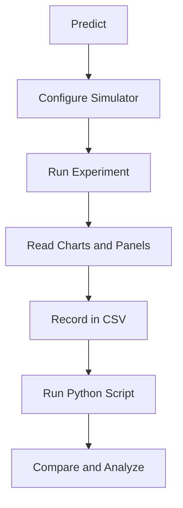

import TawkWidget from '../../../../components/TawkWidget.astro';
import UniversalContentContributors from '../../../../components/UniversalContentContributors.astro';
import InArticleAd from '../../../../components/InArticleAd.astro';
import Copyright from '../../../../components/Copyright.astro';
import BionicText from '../../../../components/BionicText.astro';
import TailwindWrapper from '../../../../components/TailwindWrapper.jsx';
import { Tabs, TabItem } from '@astrojs/starlight/components';
import { Card, CardGrid, Badge, Steps, LinkButton, FileTree } from '@astrojs/starlight/components';

<UniversalContentContributors 
  contributors={frontmatter.contributors}
/>


import MechanismDesignSimulationComments from '../../../../components/mechanism-design-simulation/MechanismDesignSimulationComments.astro';

A scissor lift looks simple: two crossed arms, a platform, and a hydraulic cylinder. But try answering this without a simulator: if you double the number of stages, does the actuator force double too? What about stability? And what happens to power requirements when the lift is nearly collapsed versus nearly vertical? These experiments take you from the basic height equation through actuator sizing, load distribution, and stability analysis, building the judgment needed to design lifts that actually work in the field. #ScissorLift #MechanismDesign #ForceAnalysis

:::tip[What you need]
Open the [Scissor Lift Mechanism Simulator](/product-development/scissor-lift-mechanism-simulator/) in a separate browser tab. You will use it throughout all nine experiments. For data analysis, you need Python 3 with NumPy and Matplotlib.
:::

:::note[Related resources]
Want to build a 3D model of this mechanism? See the [Scissor Lift Mechanism Design](/education/parametric-mechanical-cad-freecad/scissor-lift-mechanism) lesson in our FreeCAD course. For a feature overview of the simulator, see the [2D Mechanisms Analyzer](/product-development/2d-mechanisms-analyzer/scissor-lift-mechanism-simulator) page.
:::

## Reference

| Term | Meaning |
|------|---------|
| **L** | Link length: the length of each scissor arm (mm) |
| **θ (theta)** | Half-angle from horizontal. At θ = 0 the lift is fully collapsed; at θ = 90 it would be fully vertical |
| **h** | Platform height: h = n L sin(θ) for n stages |
| **S** | Spread: horizontal distance between base pivots, S = L cos(θ) |
| **P** | Platform load (N), applied as UDL or point load |
| **F** | Actuator force: the force the hydraulic cylinder or lead screw must exert |
| **MA** | Mechanical advantage: P / F. Varies continuously with angle |
| **n** | Number of scissor stages (1 to 3). Each stage adds one full link height |
| **Symmetric** | Both base pivots slide. Load shared by mechanism geometry |
| **Left-pinned** | One base pivot is fixed (pinned to ground). Single actuator bears full load |

### Experiment Workflow



### Workspace Setup

Create a working directory for your experiment files:

<FileTree>
- scissor-lift-experiments/
  - data/
  - plots/
  - scripts/
</FileTree>

---

## Experiment 1: Baseline Height and Force Profile

<InArticleAd />


Most engineers know that a scissor lift's height is h = L sin(θ), but fewer appreciate what this means for the actuator. The sinusoidal height curve hides a force curve that goes to infinity near collapse. This experiment maps both curves and reveals why every real scissor lift has a minimum operating angle.

:::note[Objective]
Verify the height equation h = n L sin(θ) and the actuator force equation F = W_eff / (2 tan θ) for a symmetric horizontal-base configuration. Understand why actuator force spikes at low angles.
:::

<Steps>
1. **Configure the simulator**
   Set L = 300 mm, Base Width = 400 mm, 1 stage, symmetric configuration, horizontal-base actuator, Platform Load = 500 N, Link Mass = 5 kg. Set operating range to 10 to 80 degrees.

2. **Predict**
   Calculate by hand: at θ = 30, h should be 300 sin(30) = 150 mm. The effective load is 500 + 2(1)(5)(9.81)/2 = 549.05 N. Actuator force should be 549.05 / (2 tan 30) = 475.5 N.

3. **Run the experiment**
   Click "Run Full Experiment." Open the Platform Height tab and the Actuator Force tab. Compare the chart shapes.

4. **Record key values**
   Read the info bar at θ = 10, 20, 30, 45, 60, and 80 degrees (use the theta slider). Record h, F, and MA at each angle.

5. **Save data**
   Create `data/exp1_baseline.csv` with columns: theta, height_sim, force_sim, MA_sim.

6. **Export charts**
   Download the Height and Actuator Force charts as PNG files to your plots folder.
</Steps>

### Data Collection Table

| θ (deg) | h_sim (mm) | F_sim (N) | MA_sim |
|---------|-----------|----------|--------|
| 10 | | | |
| 20 | | | |
| 30 | | | |
| 45 | | | |
| 60 | | | |
| 80 | | | |

### Python Analysis

```python title="experiment_1_baseline.py"
# Scissor Lift Experiment 1: Baseline Height and Force Profile
import numpy as np
import matplotlib.pyplot as plt
import os

# STEP 1: Load simulator data (if available)
csv_path = 'data/exp1_baseline.csv'
sim_data = None
if os.path.exists(csv_path):
    sim_data = np.genfromtxt(csv_path, delimiter=',', skip_header=1)
    print(f"Loaded {len(sim_data)} data points from {csv_path}")

# STEP 2: Analytical calculations
L = 300       # mm
n = 1         # stages
P = 500       # N platform load
m_link = 5    # kg per link
g = 9.81      # m/s^2

total_link_weight = 2 * n * m_link * g
effective_load = P + total_link_weight / 2

theta_deg = np.linspace(5, 85, 200)
theta_rad = np.deg2rad(theta_deg)

height = n * L * np.sin(theta_rad)
force = effective_load * n / (2 * np.tan(theta_rad))
ma = P / force

# STEP 3: Plot
fig, axes = plt.subplots(1, 3, figsize=(15, 5))

# Height vs angle
axes[0].plot(theta_deg, height, 'b-', linewidth=2, label='Analytical: h = nL sin(θ)')
if sim_data is not None:
    axes[0].plot(sim_data[:, 0], sim_data[:, 1], 'ro', markersize=6, label='Simulator')
axes[0].set_xlabel('θ (degrees)')
axes[0].set_ylabel('Height (mm)')
axes[0].set_title('Platform Height vs Angle')
axes[0].legend()
axes[0].grid(True, alpha=0.3)

# Force vs angle
axes[1].plot(theta_deg, force, 'r-', linewidth=2, label='Analytical: F = W/(2 tan θ)')
if sim_data is not None:
    axes[1].plot(sim_data[:, 0], sim_data[:, 2], 'bo', markersize=6, label='Simulator')
axes[1].set_xlabel('θ (degrees)')
axes[1].set_ylabel('Force (N)')
axes[1].set_title('Actuator Force vs Angle')
axes[1].legend()
axes[1].grid(True, alpha=0.3)
axes[1].set_ylim(0, min(3000, max(force) * 1.1))

# MA vs angle
axes[2].plot(theta_deg, ma, 'g-', linewidth=2, label='MA = P / F')
if sim_data is not None:
    axes[2].plot(sim_data[:, 0], sim_data[:, 3], 'ko', markersize=6, label='Simulator')
axes[2].set_xlabel('θ (degrees)')
axes[2].set_ylabel('Mechanical Advantage')
axes[2].set_title('Mechanical Advantage vs Angle')
axes[2].legend()
axes[2].grid(True, alpha=0.3)

plt.tight_layout()
plt.savefig('plots/exp1_baseline.png', dpi=150, bbox_inches='tight')
plt.show()
print(f"\nAt θ=30°: h={n*L*np.sin(np.deg2rad(30)):.1f} mm, F={effective_load/(2*np.tan(np.deg2rad(30))):.1f} N")
print(f"At θ=10°: F={effective_load/(2*np.tan(np.deg2rad(10))):.1f} N (note the spike)")
print(f"At θ=80°: F={effective_load/(2*np.tan(np.deg2rad(80))):.1f} N (very low)")
```

### Expected Results

- Height follows a clean sinusoidal curve from about 52 mm (at 10 degrees) to 295 mm (at 80 degrees)
- Actuator force shows a sharp hyperbolic rise below 20 degrees, reaching over 1500 N at 10 degrees
- At 45 degrees, the force equals about half the effective load (MA crosses 1.0 near this angle)
- Mechanical advantage increases monotonically with angle: poor at low angles, excellent at high angles
- The simulator and analytical values should match within 1%

### Design Question

A warehouse scissor lift must raise 2000 N from a minimum height of 200 mm to a maximum of 1500 mm, using a single-stage mechanism. What link length L and angle range would you choose, and what is the peak actuator force? Would you set the minimum angle to 5 degrees or 15 degrees, and why?

---

## Experiment 2: Comparing Actuator Types

<InArticleAd />


Three actuator types are available in the simulator: horizontal-base (hydraulic cylinder between base pivots), horizontal-center (lead screw at the arm midpoints), and diagonal (cylinder from base to partway up an arm). Each has different force, stroke, and efficiency characteristics. This experiment reveals which works best and when.

:::note[Objective]
Compare the actuator force, mechanical advantage, and power curves for all three actuator types on the same mechanism geometry. Identify which type requires the least peak force and which has the smoothest force curve.
:::

<Steps>
1. **Set common parameters**
   L = 300 mm, 1 stage, symmetric, UDL, P = 500 N, Link Mass = 5 kg, range 10 to 80 degrees.

2. **Run horizontal-base experiment**
   Select "Horizontal Base" actuator. Click "Save as Experiment A." Note the peak force, min force, and actuator stroke from the results summary.

3. **Run horizontal-center experiment**
   Switch to "Horizontal Center (lead screw)" actuator. Click "Run Full Experiment." The overlay shows both curves.

4. **Record and clear**
   Record the horizontal-center results. Click "Clear" on Experiment A.

5. **Run diagonal experiment**
   Save horizontal-center as new Experiment A. Switch to "Diagonal" actuator. Run again to compare.

6. **Collect data**
   Create `data/exp2_actuator_types.csv` with: actuator_type, peak_force, min_force, stroke, peak_power.
</Steps>

### Data Collection Table

| Actuator Type | Peak Force (N) | Min Force (N) | Stroke (mm) | Peak Power (W) |
|--------------|---------------|--------------|------------|----------------|
| Horizontal Base | | | | |
| Horizontal Center | | | | |
| Diagonal | | | | |

### Python Analysis

```python title="experiment_2_actuator_types.py"
# Scissor Lift Experiment 2: Actuator Type Comparison
import numpy as np
import matplotlib.pyplot as plt

L = 300; n = 1; P = 500; m = 5; g = 9.81
W_eff = P + 2 * n * m * g / 2
v_act = 50  # mm/s

theta = np.linspace(10, 80, 200)
theta_rad = np.deg2rad(theta)
sin_t = np.sin(theta_rad)
cos_t = np.cos(theta_rad)
tan_t = np.tan(theta_rad)

# Horizontal base (symmetric): F = W / (2 tan θ)
F_base = W_eff * n / (2 * tan_t)

# Horizontal center (symmetric): F = W / tan θ
F_center = W_eff * n / tan_t

# Diagonal: F = W * n * L * cos θ / |dD/dθ|
def diag_deriv(L, t):
    f = 0.09 * np.cos(t)**2 + 0.49 * np.sin(t)**2
    return L * 0.40 * np.sin(2*t) / (2 * np.sqrt(f))

dDdT = np.abs(diag_deriv(L, theta_rad))
F_diag = np.where(dDdT > 1e-10, W_eff * n * L * cos_t / dDdT, 0)

# Power = F * v_actuator (in Watts)
P_base = np.abs(F_base) * v_act / 1000
P_center = np.abs(F_center) * v_act / 1000
P_diag = np.abs(F_diag) * v_act / 1000

fig, axes = plt.subplots(1, 2, figsize=(12, 5))

axes[0].plot(theta, F_base, 'b-', linewidth=2, label='Horizontal Base')
axes[0].plot(theta, F_center, 'r-', linewidth=2, label='Horizontal Center')
axes[0].plot(theta, F_diag, 'g-', linewidth=2, label='Diagonal')
axes[0].set_xlabel('θ (degrees)')
axes[0].set_ylabel('Actuator Force (N)')
axes[0].set_title('Force Comparison by Actuator Type')
axes[0].legend()
axes[0].grid(True, alpha=0.3)
axes[0].set_ylim(0, 3000)

axes[1].plot(theta, P_base, 'b-', linewidth=2, label='Horizontal Base')
axes[1].plot(theta, P_center, 'r-', linewidth=2, label='Horizontal Center')
axes[1].plot(theta, P_diag, 'g-', linewidth=2, label='Diagonal')
axes[1].set_xlabel('θ (degrees)')
axes[1].set_ylabel('Power (W)')
axes[1].set_title('Power Comparison by Actuator Type')
axes[1].legend()
axes[1].grid(True, alpha=0.3)

plt.tight_layout()
plt.savefig('plots/exp2_actuator_types.png', dpi=150, bbox_inches='tight')
plt.show()

print(f"Horizontal Base: Peak F = {max(F_base):.0f} N, Min F = {min(F_base):.0f} N")
print(f"Horizontal Center: Peak F = {max(F_center):.0f} N, Min F = {min(F_center):.0f} N")
print(f"Diagonal: Peak F = {max(F_diag):.0f} N, Min F = {min(F_diag):.0f} N")
print(f"\nHorizontal Center requires {max(F_center)/max(F_base):.1f}x the peak force of Horizontal Base")
```

### Expected Results

- Horizontal-base has the lowest peak force (about half of horizontal-center) because the actuator spans the full spread
- Horizontal-center (lead screw) requires twice the force of horizontal-base for the same load, because it only spans half the geometry
- Diagonal force curve has a different shape: it peaks at a different angle and drops off more gradually
- All three produce the same height and the same effective work (energy conservation holds)
- Power curves differ because each actuator moves at different effective speeds relative to the platform

### Design Question

You are designing a lab jack that must be very compact when collapsed. The diagonal actuator has the smallest collapsed footprint. But the horizontal-center uses a lead screw which is self-locking (holds position without power). Which would you choose for a precision lab instrument, and why?

---

## Experiment 3: Symmetric vs Left-Pinned Configuration

<InArticleAd />


The simulator offers two joint arrangements: symmetric (both base pivots slide) and left-pinned (one pivot is fixed to the ground). This seemingly small change doubles the actuator force requirement. This experiment shows why, and when each configuration is the better engineering choice.

:::note[Objective]
Compare actuator force, pin forces, and stability metrics between symmetric and left-pinned configurations with identical loading. Explain the factor-of-two force difference using moment balance.
:::

<Steps>
1. **Configure symmetric baseline**
   L = 300 mm, 1 stage, symmetric, horizontal-base, P = 1000 N, Link Mass = 5 kg, range 10 to 70 degrees.

2. **Run and save as Experiment A**
   Click "Run Full Experiment," then "Save as Experiment A."

3. **Switch to left-pinned**
   Change Joint Arrangement to "Left-Pinned." Click "Run Full Experiment." The force curve overlays on the previous one.

4. **Compare force charts**
   Observe the Actuator Force tab. The left-pinned curve should be exactly 2x the symmetric curve.

5. **Compare stability**
   Check the Stability tab. Note the tipping angle and safety factor differences.

6. **Record data**
   Save `data/exp3_config_compare.csv` with: theta, F_symmetric, F_left_pinned, tipping_sym, tipping_lp.
</Steps>

### Data Collection Table

| θ (deg) | F_symmetric (N) | F_left_pinned (N) | Ratio | Tipping_sym (deg) | Tipping_lp (deg) |
|---------|-----------------|-------------------|-------|-------------------|------------------|
| 15 | | | | | |
| 30 | | | | | |
| 45 | | | | | |
| 60 | | | | | |

### Python Analysis

```python title="experiment_3_configurations.py"
# Scissor Lift Experiment 3: Symmetric vs Left-Pinned
import numpy as np
import matplotlib.pyplot as plt

L = 300; n = 1; P = 1000; m = 5; g = 9.81
W_eff = P + 2 * n * m * g / 2

theta = np.linspace(10, 70, 200)
theta_rad = np.deg2rad(theta)
tan_t = np.tan(theta_rad)
cos_t = np.cos(theta_rad)
sin_t = np.sin(theta_rad)

# Symmetric: F = W_eff / (2 tan θ)
F_sym = W_eff * n / (2 * tan_t)

# Left-pinned: F = W_eff / tan θ
F_lp = W_eff * n / tan_t

# Stability: tipping angle = atan(halfSpread / cogY)
halfSpread = (L / 2) * cos_t
height = n * L * sin_t
total_weight = P + 2 * n * m * g
link_cog_y = height / 2  # approximate
cog_y = (P * height + 2*n*m*g * link_cog_y) / total_weight
tipping = np.degrees(np.arctan(halfSpread / cog_y))

fig, axes = plt.subplots(1, 2, figsize=(12, 5))

axes[0].plot(theta, F_sym, 'b-', linewidth=2, label='Symmetric')
axes[0].plot(theta, F_lp, 'r-', linewidth=2, label='Left-Pinned')
axes[0].plot(theta, F_lp / F_sym, 'k--', linewidth=1, label='Ratio (right axis)')
axes[0].set_xlabel('θ (degrees)')
axes[0].set_ylabel('Actuator Force (N)')
axes[0].set_title('Force: Symmetric vs Left-Pinned')
axes[0].legend()
axes[0].grid(True, alpha=0.3)

axes[1].plot(theta, tipping, 'g-', linewidth=2, label='Tipping Angle')
axes[1].axhline(y=5, color='r', linestyle='--', label='5° design limit')
axes[1].set_xlabel('θ (degrees)')
axes[1].set_ylabel('Tipping Angle (degrees)')
axes[1].set_title('Stability vs Angle')
axes[1].legend()
axes[1].grid(True, alpha=0.3)

plt.tight_layout()
plt.savefig('plots/exp3_configurations.png', dpi=150, bbox_inches='tight')
plt.show()

print(f"Force ratio (left-pinned / symmetric) = {F_lp[50]/F_sym[50]:.2f} (should be 2.00)")
print(f"Tipping angle at θ=45°: {tipping[np.argmin(np.abs(theta-45))]:.1f}°")
```

### Expected Results

- Left-pinned actuator force is exactly 2x the symmetric force at every angle
- This is because symmetric has two "virtual actuators" sharing the load through geometry, while left-pinned has one actuator doing all the work
- Stability (tipping angle) is the same for both when the load is centered, because the base footprint is identical
- Pin forces differ: the fixed pin in left-pinned carries a much larger horizontal reaction

### Design Question

A car jack must be operated by hand with a screw mechanism. Would you choose symmetric or left-pinned? Consider that the hand force is limited, but the jack needs to be stable on uneven ground. What about a warehouse lift that uses a hydraulic pump?

---

## Experiment 4: Multi-Stage Height Multiplication

<InArticleAd />


Adding stages to a scissor lift multiplies the height but also multiplies the actuator force and degrades stability. This experiment quantifies all three effects and reveals why most practical scissor lifts use 1 to 3 stages.

:::note[Objective]
Compare the height, actuator force, and stability of 1-stage, 2-stage, and 3-stage scissor lifts with the same link length. Verify that height scales as n but force also scales as n.
:::

<Steps>
1. **Configure 1-stage baseline**
   L = 300 mm, symmetric, horizontal-base, P = 500 N, Link Mass = 5 kg, range 10 to 70 degrees.

2. **Run and save as Experiment A**
   Record max height, peak force, and min tipping angle from the results summary.

3. **Switch to 2 stages**
   Change Number of Stages to 2. Click "Run Full Experiment." The overlay shows both.

4. **Record 2-stage results**
   Note the new max height (should be 2x), peak force (should be roughly 2x), and min tipping angle (should be lower).

5. **Clear and test 3 stages**
   Clear Experiment A, save 2-stage as new A, switch to 3 stages, run again.

6. **Collect all data**
   Save `data/exp4_stages.csv` with: stages, max_height, peak_force, min_tipping_angle, actuator_stroke.
</Steps>

### Data Collection Table

| Stages | Max Height (mm) | Peak Force (N) | Min Tipping Angle (deg) | Actuator Stroke (mm) |
|--------|----------------|---------------|------------------------|---------------------|
| 1 | | | | |
| 2 | | | | |
| 3 | | | | |

### Python Analysis

```python title="experiment_4_stages.py"
# Scissor Lift Experiment 4: Multi-Stage Comparison
import numpy as np
import matplotlib.pyplot as plt

L = 300; P = 500; m = 5; g = 9.81

theta = np.linspace(10, 70, 200)
theta_rad = np.deg2rad(theta)

fig, axes = plt.subplots(1, 3, figsize=(15, 5))
colors = ['#2A9D8F', '#E9C46A', '#ef4444']

for n in [1, 2, 3]:
    W_eff = P + 2 * n * m * g / 2
    height = n * L * np.sin(theta_rad)
    force = W_eff * n / (2 * np.tan(theta_rad))

    # Stability
    halfSpread = (L / 2) * np.cos(theta_rad)
    total_weight = P + 2 * n * m * g
    cog_y = (P * height + 2*n*m*g * height/2) / total_weight
    tipping = np.degrees(np.arctan(halfSpread / cog_y))

    axes[0].plot(theta, height, color=colors[n-1], linewidth=2, label=f'{n} stage(s)')
    axes[1].plot(theta, force, color=colors[n-1], linewidth=2, label=f'{n} stage(s)')
    axes[2].plot(theta, tipping, color=colors[n-1], linewidth=2, label=f'{n} stage(s)')

axes[0].set_title('Height vs Angle'); axes[0].set_ylabel('Height (mm)')
axes[1].set_title('Actuator Force vs Angle'); axes[1].set_ylabel('Force (N)')
axes[1].set_ylim(0, 5000)
axes[2].set_title('Tipping Angle vs Angle'); axes[2].set_ylabel('Tipping Angle (deg)')
axes[2].axhline(y=5, color='k', linestyle='--', alpha=0.5, label='5° limit')

for ax in axes:
    ax.set_xlabel('θ (degrees)')
    ax.legend()
    ax.grid(True, alpha=0.3)

plt.tight_layout()
plt.savefig('plots/exp4_stages.png', dpi=150, bbox_inches='tight')
plt.show()

for n in [1, 2, 3]:
    W_eff = P + 2 * n * m * g / 2
    h_max = n * L * np.sin(np.deg2rad(70))
    F_peak = W_eff * n / (2 * np.tan(np.deg2rad(10)))
    print(f"{n}-stage: max height = {h_max:.0f} mm, peak force = {F_peak:.0f} N")
```

### Expected Results

- Height scales linearly: 2-stage gives exactly 2x the height, 3-stage gives 3x
- Force scales more than linearly because each added stage adds its own link weight to the effective load
- Stability (tipping angle) degrades significantly with stages: the CoG rises faster than the base width changes
- Actuator stroke is the same for all stages (it depends on angle range and link length, not stage count)
- A 3-stage lift at 70 degrees gives about 845 mm height but with a tipping angle that may be dangerously low

### Design Question

An aerial work platform needs to reach 3.6 meters. You have two options: (A) 3 stages with L = 1200 mm, or (B) 2 stages with L = 1800 mm. Both give the same max height. Which has better stability? Which requires less actuator force? Which is easier to transport (collapsed height)?

---

## Experiment 5: Point Load vs Uniform Distributed Load

<InArticleAd />


The simulator supports two load types: UDL (uniform distributed load, the default) and point load at a configurable position. For a symmetric configuration with centered loading, the forces are mathematically identical. But the story changes when the load shifts off-center or when you examine stability. This experiment reveals the differences.

:::note[Objective]
Verify that centered UDL and centered point load produce identical actuator forces. Then explore how offset point loads affect pin forces and stability, while UDL remains stable.
:::

<Steps>
1. **Configure UDL baseline**
   L = 300 mm, 1 stage, symmetric, horizontal-base, P = 1000 N, UDL. Range 10 to 70 degrees.

2. **Run and save as Experiment A**
   Click "Run Full Experiment" and save as Experiment A.

3. **Switch to centered point load**
   Change Load Distribution to "Point Load," offset = 0. Run again. The force curves should overlay perfectly.

4. **Verify identity**
   Check the Actuator Force tab: the two curves should be indistinguishable. This proves that centered point load equals UDL for symmetric configs.

5. **Add offset**
   Set Load Position to +100 mm. Run again. Check the Joint Pin Forces tab for left/right asymmetry.

6. **Check stability impact**
   Open the Stability tab. Compare the tipping angle and safety factor with UDL vs offset point load.

7. **Record data**
   Save `data/exp5_load_types.csv` with: load_type, offset, peak_force, left_pin, right_pin, min_tipping.
</Steps>

### Data Collection Table

| Load Type | Offset (mm) | Peak Force (N) | Max Left Pin (N) | Max Right Pin (N) | Min Tipping (deg) |
|-----------|-------------|---------------|------------------|-------------------|-------------------|
| UDL | 0 | | | | |
| Point | 0 | | | | |
| Point | +50 | | | | |
| Point | +100 | | | | |

### Python Analysis

```python title="experiment_5_load_types.py"
# Scissor Lift Experiment 5: UDL vs Point Load
import numpy as np
import matplotlib.pyplot as plt

L = 300; n = 1; P = 1000; m = 5; g = 9.81
total_link_weight = 2 * n * m * g
W_eff = P + total_link_weight / 2

theta = np.linspace(10, 70, 200)
theta_rad = np.deg2rad(theta)
halfSpread = (L / 2) * np.cos(theta_rad)
height = n * L * np.sin(theta_rad)

offsets = [0, 50, 100]
fig, axes = plt.subplots(1, 2, figsize=(12, 5))

for x0 in offsets:
    x0_clamped = np.clip(x0, -halfSpread, halfSpread)

    if x0 == 0:
        R_left = W_eff / 2 * np.ones_like(theta)
        R_right = W_eff / 2 * np.ones_like(theta)
    else:
        R_left = P * (halfSpread - x0_clamped) / (2 * halfSpread) + total_link_weight / 4
        R_right = P * (halfSpread + x0_clamped) / (2 * halfSpread) + total_link_weight / 4

    # Stability: worst-case margin
    total_weight = P + total_link_weight
    cog_x = P * x0 / total_weight  # approximate
    cog_y = (P * height + total_link_weight * height / 2) / total_weight
    margin = np.minimum(halfSpread + cog_x, halfSpread - cog_x)
    tipping = np.degrees(np.arctan(margin / cog_y))

    label = f'UDL (centered)' if x0 == 0 else f'Point, e={x0} mm'
    axes[0].plot(theta, R_right - R_left, linewidth=2, label=label)
    axes[1].plot(theta, tipping, linewidth=2, label=label)

axes[0].set_title('Pin Force Imbalance (R_right - R_left)')
axes[0].set_xlabel('θ (degrees)'); axes[0].set_ylabel('Force Difference (N)')
axes[0].legend(); axes[0].grid(True, alpha=0.3)

axes[1].set_title('Tipping Angle vs Offset')
axes[1].set_xlabel('θ (degrees)'); axes[1].set_ylabel('Tipping Angle (deg)')
axes[1].axhline(y=5, color='r', linestyle='--', label='5° design limit')
axes[1].legend(); axes[1].grid(True, alpha=0.3)

plt.tight_layout()
plt.savefig('plots/exp5_load_types.png', dpi=150, bbox_inches='tight')
plt.show()
```

### Expected Results

- Centered UDL and centered point load produce identical actuator force curves (the overlay is perfect)
- Offset point loads create asymmetric pin forces: the side closer to the load carries more
- Stability degrades with offset: tipping angle drops significantly at e = 100 mm compared to centered loading
- The actuator force (total) remains approximately the same regardless of offset for symmetric config, because the total vertical load hasn't changed
- The key engineering insight: UDL is inherently more stable than an equivalent point load at any offset

### Design Question

A loading dock leveler must handle both centered pallet loads (UDL-like) and a forklift driving onto one side (offset point load). What safety factor would you design for, and should you use symmetric or left-pinned configuration?

---

## Experiment 6: Eccentric Loading and Tipping Safety

<InArticleAd />


Every scissor lift has a maximum allowable load eccentricity. Exceed it and the lift tips over. This experiment systematically increases the point load offset until the safety factor drops below acceptable limits, mapping the safe operating envelope.

:::note[Objective]
Determine the maximum safe load offset for a given configuration by sweeping the offset parameter and recording tipping angle and safety factor at different heights. Establish a safe operating envelope.
:::

<Steps>
1. **Configure**
   L = 400 mm, 1 stage, symmetric, horizontal-base, P = 2000 N, point load, offset = 0. Range 15 to 65 degrees.

2. **Sweep offsets at fixed angle**
   Set θ = 45 degrees. Record tipping angle and safety factor for offsets: 0, 25, 50, 75, 100, 125, 150 mm.

3. **Find critical offset**
   The critical offset is where the safety factor drops below 2.0 (a common engineering minimum). Note this value.

4. **Repeat at high angle**
   Set θ = 60 degrees (higher platform). Repeat the sweep. The critical offset should be smaller because the CoG is higher.

5. **Build the envelope**
   Create `data/exp6_tipping.csv` with: theta, offset, tipping_angle, safety_factor.
</Steps>

### Data Collection Table

| θ (deg) | Offset (mm) | Tipping Angle (deg) | Safety Factor |
|---------|-------------|--------------------|--------------|
| 45 | 0 | | |
| 45 | 50 | | |
| 45 | 100 | | |
| 45 | 150 | | |
| 60 | 0 | | |
| 60 | 50 | | |
| 60 | 100 | | |

### Python Analysis

```python title="experiment_6_tipping.py"
# Scissor Lift Experiment 6: Eccentric Loading Envelope
import numpy as np
import matplotlib.pyplot as plt

L = 400; n = 1; P = 2000; m = 5; g = 9.81
total_link_weight = 2 * n * m * g
total_weight = P + total_link_weight

thetas = [30, 45, 60]
offsets = np.linspace(0, 180, 100)

fig, ax = plt.subplots(figsize=(8, 6))
colors = ['#2A9D8F', '#E9C46A', '#ef4444']

for idx, theta_deg in enumerate(thetas):
    theta_rad = np.deg2rad(theta_deg)
    halfSpread = (L / 2) * np.cos(theta_rad)
    height = n * L * np.sin(theta_rad)

    tipping_angles = []
    for e in offsets:
        e_clamped = min(e, halfSpread)
        cog_x = P * e_clamped / total_weight
        cog_y = (P * height + total_link_weight * height / 2) / total_weight
        margin = min(halfSpread + cog_x, halfSpread - cog_x)
        tip = np.degrees(np.arctan(max(margin, 0) / cog_y)) if cog_y > 0 else 0
        tipping_angles.append(tip)

    ax.plot(offsets, tipping_angles, color=colors[idx], linewidth=2, label=f'θ = {theta_deg}°')

ax.axhline(y=10, color='orange', linestyle='--', linewidth=1, label='10° warning')
ax.axhline(y=5, color='red', linestyle='--', linewidth=1, label='5° critical')
ax.set_xlabel('Load Offset from Center (mm)')
ax.set_ylabel('Tipping Angle (degrees)')
ax.set_title('Tipping Safety vs Load Eccentricity')
ax.legend()
ax.grid(True, alpha=0.3)
ax.set_ylim(0, 50)

plt.tight_layout()
plt.savefig('plots/exp6_tipping.png', dpi=150, bbox_inches='tight')
plt.show()

# Find critical offsets (where tipping < 10°)
for theta_deg in thetas:
    theta_rad = np.deg2rad(theta_deg)
    halfSpread = (L / 2) * np.cos(theta_rad)
    height = n * L * np.sin(theta_rad)
    for e in range(0, int(halfSpread), 5):
        cog_x = P * e / total_weight
        cog_y = (P * height + total_link_weight * height / 2) / total_weight
        margin = min(halfSpread + cog_x, halfSpread - cog_x)
        tip = np.degrees(np.arctan(max(margin, 0) / cog_y))
        if tip < 10:
            print(f"θ={theta_deg}°: Critical offset (tipping < 10°) at e = {e} mm")
            break
```

### Expected Results

- At low angles (θ = 30), the lift is very stable and tolerates large offsets before the safety factor drops
- At high angles (θ = 60), even small offsets significantly reduce the safety factor because the CoG is high and the base is narrow
- The tipping angle decreases linearly with offset for small offsets, then drops faster as the CoG approaches the support edge
- The safe operating envelope is roughly triangular: more offset is acceptable at low heights, less at high heights
- A 2000 N load at θ = 60 with L = 400 mm becomes dangerously unstable beyond about 80 mm offset

### Design Question

An aerial work platform must be rated for workers moving around on the platform (dynamic point loads). The platform is 1.5 m wide and workers weigh up to 100 kg. What is the worst-case offset, and does your design pass the 5-degree tipping angle requirement at maximum height?

---

## Experiment 7: Energy and Power Requirements

<InArticleAd />


Sizing the hydraulic pump or electric motor for a scissor lift requires knowing the peak power, total energy, and how power varies across the operating range. This experiment maps the complete energy and power profile and connects it to real actuator selection.

:::note[Objective]
Calculate the total energy required to raise a loaded platform from minimum to maximum height. Determine the peak power requirement and at what angle it occurs. Verify energy conservation between work done and potential energy gained.
:::

<Steps>
1. **Configure**
   L = 500 mm, 1 stage, symmetric, horizontal-base, P = 3000 N, Link Mass = 10 kg, Actuator Speed = 30 mm/s, range 10 to 70 degrees.

2. **Run the experiment**
   Click "Run Full Experiment." Open the Energy tab and the Power tab.

3. **Verify energy conservation**
   The Cumulative Work curve and the Potential Energy curve should overlay closely. If they diverge, there is an error in the calculations.

4. **Find peak power**
   Note the maximum power from the Power chart. At what angle does it occur?

5. **Calculate hydraulic requirements**
   Using peak power and actuator force at that angle, calculate the required hydraulic flow rate: Q = P_power / (F * pressure_efficiency).

6. **Record data**
   Save `data/exp7_energy.csv` with: theta, PE, work_done, power, force.
</Steps>

### Python Analysis

```python title="experiment_7_energy.py"
# Scissor Lift Experiment 7: Energy and Power Analysis
import numpy as np
import matplotlib.pyplot as plt

L = 500; n = 1; P = 3000; m = 10; g = 9.81; v_act = 30
total_link_weight = 2 * n * m * g
W_eff = P + total_link_weight / 2

theta = np.linspace(10, 70, 200)
theta_rad = np.deg2rad(theta)

height = n * L * np.sin(theta_rad)
h_min = n * L * np.sin(np.deg2rad(10))
delta_h = height - h_min

# Potential energy (J) = force (N) * height (m)
PE_platform = P * delta_h / 1000
PE_links = total_link_weight * delta_h / 2000
PE_total = PE_platform + PE_links

# Actuator force
force = W_eff * n / (2 * np.tan(theta_rad))

# Power = F * v_actuator (W)
power = np.abs(force) * v_act / 1000

# Cumulative work (numerical integration)
work = np.zeros_like(theta)
for i in range(1, len(theta)):
    dh = height[i] - height[i-1]
    work[i] = work[i-1] + W_eff * abs(dh) / 1000

fig, axes = plt.subplots(1, 3, figsize=(15, 5))

axes[0].plot(theta, PE_total, 'b-', linewidth=2, label='Potential Energy')
axes[0].plot(theta, work, 'r--', linewidth=2, label='Cumulative Work')
axes[0].set_xlabel('θ (degrees)'); axes[0].set_ylabel('Energy (J)')
axes[0].set_title('Energy Conservation'); axes[0].legend(); axes[0].grid(True, alpha=0.3)

axes[1].plot(theta, power, 'g-', linewidth=2)
peak_idx = np.argmax(power)
axes[1].axvline(x=theta[peak_idx], color='r', linestyle='--', alpha=0.5)
axes[1].annotate(f'Peak: {power[peak_idx]:.1f} W at {theta[peak_idx]:.0f}°',
    xy=(theta[peak_idx], power[peak_idx]), fontsize=10)
axes[1].set_xlabel('θ (degrees)'); axes[1].set_ylabel('Power (W)')
axes[1].set_title('Power Required'); axes[1].grid(True, alpha=0.3)

axes[2].plot(theta, force, 'r-', linewidth=2)
axes[2].set_xlabel('θ (degrees)'); axes[2].set_ylabel('Actuator Force (N)')
axes[2].set_title('Actuator Force'); axes[2].grid(True, alpha=0.3)

plt.tight_layout()
plt.savefig('plots/exp7_energy.png', dpi=150, bbox_inches='tight')
plt.show()

print(f"Total energy to raise: {PE_total[-1]:.1f} J")
print(f"Peak power: {max(power):.1f} W at θ = {theta[np.argmax(power)]:.0f}°")
print(f"Peak force: {max(force):.0f} N at θ = {theta[0]:.0f}°")
print(f"Energy conservation: work/PE = {work[-1]/PE_total[-1]:.4f}")
```

### Expected Results

- PE and cumulative work curves overlay closely (ratio should be 1.0, verifying energy conservation)
- Peak power occurs at the lowest angle (around 10 degrees) where force is highest and actuator speed translates to the fastest platform rise
- Total energy is typically a few hundred joules for a medium-sized lift
- The power curve has the same shape as the force curve (since actuator speed is constant)
- A 3000 N load on a 500 mm link from 10 to 70 degrees requires roughly 40 to 80 W peak power

### Design Question

You need to select a hydraulic power unit for a loading dock leveler (P = 8000 N, L = 400 mm, range 5 to 45 degrees). Calculate the peak power requirement. If the hydraulic system is 70% efficient, what motor power rating would you specify? Would a 0.5 HP motor be sufficient?

---

## Experiment 8: Link Stress and Structural Limits

<InArticleAd />


The scissor arms are not just kinematic elements; they are structural beams under combined bending and axial loads. This experiment examines how bending stress varies with angle and load, helping determine the minimum cross-section dimensions for a given application.

:::note[Objective]
Plot the link bending stress across the operating range for different loads. Determine the angle at which stress is maximum and compare it to the yield strength of common engineering materials.
:::

<Steps>
1. **Configure**
   L = 300 mm, 1 stage, symmetric, horizontal-base, Link Mass = 5 kg, range 10 to 80 degrees.

2. **Run at P = 500 N**
   Click "Run Full Experiment." Check the Link Stress tab. Record the max stress.

3. **Increase to P = 2000 N**
   Save previous as Experiment A. Set P = 2000 N. Run again to see the overlay.

4. **Try P = 5000 N**
   Clear, save 2000 N as A, set P = 5000 N. Run to compare.

5. **Compare with material limits**
   Mild steel yields at about 250 MPa, aluminum at about 270 MPa. Is the stress safely below these limits?

6. **Record data**
   Save `data/exp8_stress.csv` with: load, max_stress, angle_at_max_stress.
</Steps>

### Data Collection Table

| Load P (N) | Max Stress (MPa) | Safety Factor (Steel, 250 MPa) |
|-----------|-----------------|-------------------------------|
| 500 | | |
| 1000 | | |
| 2000 | | |
| 5000 | | |

### Python Analysis

```python title="experiment_8_stress.py"
# Scissor Lift Experiment 8: Link Stress Analysis
import numpy as np
import matplotlib.pyplot as plt

L = 300; n = 1; m = 5; g = 9.81

loads = [500, 1000, 2000, 5000]
theta = np.linspace(10, 80, 200)
theta_rad = np.deg2rad(theta)

# Link cross-section assumptions (same as simulator)
b = L / 20   # width = 15 mm
h = L / 10   # height = 30 mm
I = b * h**3 / 12  # second moment of area
c = h / 2    # distance to neutral axis

fig, ax = plt.subplots(figsize=(8, 6))
colors = ['#2A9D8F', '#E9C46A', '#f97316', '#ef4444']

for idx, P in enumerate(loads):
    W_eff = P + 2 * n * m * g / 2
    F_arm = W_eff / (2 * n)    # load per arm
    M = F_arm * L / 4           # bending moment at quarter span
    stress = M * c / I / 1e6    # convert Pa to MPa (constant with angle in this model)

    ax.axhline(y=stress, color=colors[idx], linewidth=2, label=f'P = {P} N ({stress:.1f} MPa)')

ax.axhline(y=250, color='red', linestyle='--', linewidth=1.5, label='Steel yield (250 MPa)')
ax.axhline(y=270, color='blue', linestyle='--', linewidth=1.5, label='Al 6061 yield (270 MPa)')

ax.set_xlabel('Platform Load P (N)')
ax.set_ylabel('Bending Stress (MPa)')
ax.set_title('Link Bending Stress vs Load')
ax.legend()
ax.grid(True, alpha=0.3)
ax.set_ylim(0, 300)

plt.tight_layout()
plt.savefig('plots/exp8_stress.png', dpi=150, bbox_inches='tight')
plt.show()

print("Cross-section: b = {:.0f} mm, h = {:.0f} mm, I = {:.0f} mm^4".format(b, h, I))
for P in loads:
    W_eff = P + 2 * n * m * g / 2
    F_arm = W_eff / (2 * n)
    M = F_arm * L / 4
    stress = M * c / I / 1e6
    sf = 250 / stress
    print(f"P = {P} N: stress = {stress:.1f} MPa, safety factor (steel) = {sf:.1f}")
```

### Expected Results

- Bending stress is approximately constant across the angle range (the simplified model treats it as a statically loaded beam)
- Stress scales linearly with load: doubling the platform load roughly doubles the stress
- For the default 300 mm link with 15 x 30 mm cross-section, a 500 N load gives about 9 MPa (very safe)
- A 5000 N load pushes the stress higher, but still below steel yield for this geometry
- The safety factor against yield decreases linearly with load

### Design Question

Your scissor lift must carry 10,000 N. The current link cross-section (L/20 x L/10) gives a stress of about 90 MPa. You need a safety factor of at least 3.0 against yield for a mild steel link. What minimum cross-section dimensions would you specify? Would you change the height, width, or both?

---

## Experiment 9: Comparing Real-World Presets

<InArticleAd />


The simulator includes eight presets modeled after real scissor lift applications: warehouse lifts, car jacks, aerial platforms, lab jacks, loading docks, automotive hoists, electric tables, and work tables. Each represents different engineering tradeoffs. This experiment compares them all.

:::note[Objective]
Run all eight presets and compare their force, power, height, stability, and efficiency characteristics. Identify what design choices define each application category and what engineering tradeoffs they represent.
:::

<Steps>
1. **Run each preset**
   Select each preset from the dropdown and click "Run Full Experiment." For each, record: max height, peak force, peak power, min tipping angle, actuator type, and configuration.

2. **Use A/B comparison**
   Save "Warehouse Lift" as Experiment A. Then run "Lab Jack" to see the dramatic difference in scale on the same charts.

3. **Group by actuator type**
   Note which presets use horizontal-base, horizontal-center (lead screw), and diagonal actuators. How do the force curves differ?

4. **Group by configuration**
   Which use symmetric vs left-pinned? How does this correlate with the application?

5. **Record all data**
   Create `data/exp9_presets.csv` with all preset names and their key metrics.
</Steps>

### Data Collection Table

| Preset | Config | Actuator | Stages | Max Height (mm) | Peak Force (N) | Peak Power (W) | Min Tipping (deg) |
|--------|--------|----------|--------|-----------------|---------------|----------------|-------------------|
| Warehouse Lift | | | | | | | |
| Car Jack | | | | | | | |
| Aerial Platform | | | | | | | |
| Lab Jack | | | | | | | |
| Loading Dock | | | | | | | |
| Auto Hoist | | | | | | | |
| Electric Table | | | | | | | |
| Work Table | | | | | | | |

### Python Analysis

```python title="experiment_9_presets.py"
# Scissor Lift Experiment 9: Real-World Preset Comparison
import numpy as np
import matplotlib.pyplot as plt

presets = {
    'Warehouse Lift': dict(L=700, n=3, P=2000, m=15, config='sym', act='h-base', min_t=12, max_t=75),
    'Car Jack':       dict(L=300, n=1, P=5000, m=3,  config='l-pin', act='h-base', min_t=10, max_t=70),
    'Aerial Platform':dict(L=1200, n=3, P=3000, m=40, config='sym', act='h-base', min_t=10, max_t=70),
    'Lab Jack':       dict(L=80,  n=1, P=50,   m=0.5, config='sym', act='h-center', min_t=15, max_t=75),
    'Loading Dock':   dict(L=400, n=1, P=8000, m=20, config='sym', act='h-base', min_t=5, max_t=45),
    'Auto Hoist':     dict(L=500, n=2, P=10000, m=25, config='l-pin', act='diag', min_t=10, max_t=65),
    'Electric Table': dict(L=350, n=1, P=1500, m=8,  config='l-pin', act='h-center', min_t=10, max_t=70),
    'Work Table':     dict(L=450, n=1, P=3000, m=12, config='sym', act='diag', min_t=8, max_t=60),
}

g = 9.81
results = []

for name, p in presets.items():
    W_eff = p['P'] + 2 * p['n'] * p['m'] * g / 2
    max_h = p['n'] * p['L'] * np.sin(np.deg2rad(p['max_t']))
    min_h = p['n'] * p['L'] * np.sin(np.deg2rad(p['min_t']))

    # Peak force at minimum angle
    if p['act'] == 'h-base':
        if p['config'] == 'sym':
            peak_F = W_eff * p['n'] / (2 * np.tan(np.deg2rad(p['min_t'])))
        else:
            peak_F = W_eff * p['n'] / np.tan(np.deg2rad(p['min_t']))
    elif p['act'] == 'h-center':
        if p['config'] == 'sym':
            peak_F = W_eff * p['n'] / np.tan(np.deg2rad(p['min_t']))
        else:
            peak_F = W_eff * p['n'] * 2 / np.tan(np.deg2rad(p['min_t']))
    else:
        peak_F = W_eff * p['n'] * 3  # rough estimate for diagonal

    results.append((name, max_h, peak_F, p['config'], p['act'], p['n']))
    print(f"{name:20s}: max h = {max_h:7.0f} mm, peak F = {peak_F:8.0f} N, {p['config']:5s}/{p['act']}")

# Bar chart comparison
fig, axes = plt.subplots(1, 2, figsize=(14, 6))
names = [r[0] for r in results]
heights = [r[1] for r in results]
forces = [r[2] for r in results]
x = np.arange(len(names))

axes[0].barh(x, heights, color='#2A9D8F', alpha=0.8)
axes[0].set_yticks(x); axes[0].set_yticklabels(names)
axes[0].set_xlabel('Max Height (mm)')
axes[0].set_title('Maximum Platform Height')
axes[0].grid(True, alpha=0.3, axis='x')

axes[1].barh(x, [f/1000 for f in forces], color='#ef4444', alpha=0.8)
axes[1].set_yticks(x); axes[1].set_yticklabels(names)
axes[1].set_xlabel('Peak Actuator Force (kN)')
axes[1].set_title('Peak Actuator Force')
axes[1].grid(True, alpha=0.3, axis='x')

plt.tight_layout()
plt.savefig('plots/exp9_presets.png', dpi=150, bbox_inches='tight')
plt.show()
```

### Expected Results

- Aerial Platform has the largest max height (over 3300 mm with 3 stages and L = 1200 mm)
- Loading Dock has the highest peak actuator force (over 40,000 N at its 5-degree minimum angle)
- Lab Jack has the smallest forces (under 200 N) and the most compact dimensions
- Car Jack uses left-pinned because it needs a fixed base point for stability on uneven ground
- Lead screw actuators (Lab Jack, Electric Table) are self-locking: they hold position without hydraulic pressure
- Diagonal actuators (Auto Hoist, Work Table) offer a compact folded profile but complex force curves
- The number of stages correlates strongly with required height: 3-stage for tall lifts, 1-stage for compact ones

### Design Question

You are asked to design a scissor lift for a theater stage that must raise a 2 m x 3 m platform weighing 500 kg from floor level to 2 meters above stage. The lift must be silent (no hydraulic pump noise) and hold position precisely. Which actuator type, configuration, number of stages, and link length would you choose? What is your estimated peak force and motor power?

---

<MechanismDesignSimulationComments />


<InArticleAd />
<TawkWidget />
<Copyright />