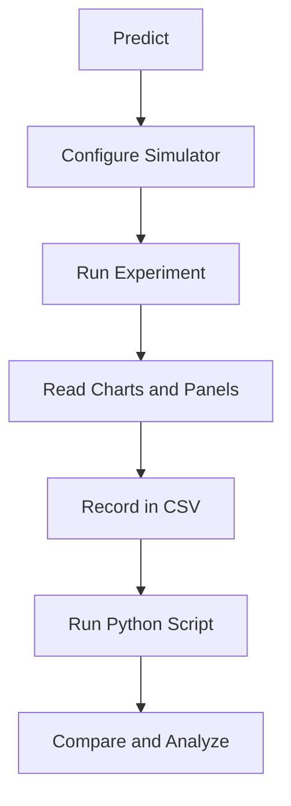

import TawkWidget from '../../../../components/TawkWidget.astro';
import UniversalContentContributors from '../../../../components/UniversalContentContributors.astro';
import InArticleAd from '../../../../components/InArticleAd.astro';
import Copyright from '../../../../components/Copyright.astro';
import BionicText from '../../../../components/BionicText.astro';
import TailwindWrapper from '../../../../components/TailwindWrapper.jsx';
import { Tabs, TabItem } from '@astrojs/starlight/components';
import { Card, CardGrid, Badge, Steps, LinkButton, FileTree } from '@astrojs/starlight/components';

<UniversalContentContributors 
  contributors={frontmatter.contributors}
/>


import MechanismDesignSimulationComments from '../../../../components/mechanism-design-simulation/MechanismDesignSimulationComments.astro';

A toggle clamp holds a workpiece with a force many times larger than the hand effort that sets it, and then holds it with no effort at all. Both facts come from one idea: driving a linkage just past a dead-centre position. These six experiments make that idea concrete. You will find top-dead-centre, watch the force amplification rise and fall, keep the transmission angle healthy, size the pins and links so they survive the load, and finally pick a clamp for a real job. #ToggleClamp #MechanismDesign #ForceAnalysis

:::tip[What you need]
The [Toggle Clamp Mechanism Simulator](/product-development/toggle-clamp-mechanism-simulator/), and Python 3 with NumPy and Matplotlib for the analysis scripts (`pip install numpy matplotlib`).
:::

:::note[Related resources]
Build the clamp parametrically in the [FreeCAD Toggle Clamp lesson](/education/parametric-mechanical-cad-freecad/toggle-clamp-mechanism), and see the full tool set on the [2D Mechanisms Analyzer](/product-development/2d-mechanisms-analyzer/) page.
:::

## Reference

| Term | Meaning |
|------|---------|
| **TDC** | Top-dead-centre: the handle position where the handle and main link line up (collinear) and the mechanical advantage diverges |
| **Lock margin** | Degrees the handle rests past TDC against a stop, which makes the clamp self-locking |
| **alpha (toggle angle)** | Angle of the main link away from the collinear TDC position; small alpha means near TDC |
| **MA** | Mechanical advantage, the ratio of pad clamping force to handle force, F_pad / F_handle |
| **mu (transmission angle)** | Angle at the toggle joint between the main link and the clamp arm; below about 40 degrees the linkage transmits force poorly |
| **phi (friction angle)** | arctan of the pin friction coefficient; it shifts the effective toggle angle and caps the achievable MA |
| **Sy, N** | Material yield strength and design safety factor; allowable stress = Sy / N |

### Experiment Workflow



### Workspace Setup

<FileTree>
- toggle-clamp-experiments/
  - data/
  - plots/
  - scripts/
</FileTree>

---

## Experiment 1: Top-Dead-Centre and Self-Locking

<InArticleAd />


Everyone who has used a toggle clamp has felt the handle "snap" over a hard point and then sit there, holding, on its own. That hard point is top-dead-centre, where the handle and main link are collinear. This experiment locates TDC and shows why resting a few degrees past it makes the clamp lock itself.

:::note[Objective]
Find the top-dead-centre handle angle for the medium-duty preset, observe the mechanical-advantage spike at TDC, and explain why a small lock margin past TDC produces a self-holding clamp.
:::

<Steps>
1. **Configure the simulator**
   Open the simulator and select the Medium-duty vertical preset. Note the info bar shows the TDC handle angle. Keep "Show parameter cues" on so you can see the TDC reference line on the diagram.

2. **Predict**
   At TDC the handle and main link are collinear, so the ideal toggle relation MA = 1 / (2 tan(alpha)) diverges as the toggle angle alpha goes to zero. Predict that the mechanical-advantage chart spikes as the handle approaches TDC.

3. **Sweep the handle**
   Drag the handle-angle slider slowly from open toward the locked stop. Watch the MA value in the info bar and the teal current-angle line cross the red TDC line on the charts.

4. **Record values near TDC**
   Using the lock-margin slider, set the lock margin to 2, 4, 6, 8, 10, and 12 degrees. At each setting read the engineering MA and the clamping force at lock from the panel.

5. **Save data**
   Create `data/exp1_tdc.csv` with columns: lock_margin_deg, MA_sim, Fpad_sim.
</Steps>

### Data Collection Table

| Lock margin (deg) | MA_sim | F_pad,sim (N) |
|-------------------|--------|---------------|
| 2 | | |
| 4 | | |
| 6 | | |
| 8 | | |
| 10 | | |
| 12 | | |

### Python Analysis

```python title="experiment_1_tdc.py"
# Toggle Clamp Experiment 1: Top-Dead-Centre and Self-Locking
import numpy as np
import matplotlib.pyplot as plt
import os

os.makedirs('plots', exist_ok=True)

# Ideal toggle relation: MA = 1 / (2 tan(alpha)), alpha = toggle angle past TDC
alpha_deg = np.linspace(1, 40, 300)
alpha = np.deg2rad(alpha_deg)
MA_ideal = 1.0 / (2.0 * np.tan(alpha))

# Load simulator readings if present (lock margin ~ toggle angle alpha)
csv_path = 'data/exp1_tdc.csv'
sim = np.genfromtxt(csv_path, delimiter=',', skip_header=1) if os.path.exists(csv_path) else None

plt.figure(figsize=(8, 5))
plt.plot(alpha_deg, MA_ideal, '-', color='#2A9D8F', linewidth=2,
         label='Ideal toggle: MA = 1/(2 tan a)')
if sim is not None:
    plt.plot(sim[:, 0], sim[:, 1], 'o', color='#ef4444', markersize=6, label='Simulator (engineering)')
plt.axvline(0, color='#ef4444', linestyle='--', alpha=0.6)
plt.text(0.5, plt.ylim()[1] * 0.8, 'TDC', color='#ef4444')
plt.xlabel('Toggle angle past TDC, alpha (deg)')
plt.ylabel('Mechanical advantage')
plt.title('Force amplification diverges at top-dead-centre')
plt.ylim(0, 20)
plt.legend()
plt.grid(True, alpha=0.3)
plt.tight_layout()
plt.savefig('plots/exp1_tdc.png', dpi=150, bbox_inches='tight')
plt.show()

for a in [2, 5, 10]:
    print(f"alpha={a:2d} deg -> ideal MA = {1/(2*np.tan(np.deg2rad(a))):.2f}")
print("As alpha -> 0 (TDC), MA -> infinity: a tiny push holds a large load,")
print("so resting a few degrees PAST TDC against a stop makes the clamp self-lock.")
```

### Expected Results

- The ideal mechanical advantage rises sharply as the toggle angle approaches zero (TDC), in theory without bound
- The simulator's engineering MA follows the same shape but stays finite, because pin friction and efficiency cap it
- At a 5-degree lock margin the ideal relation predicts MA near 5.7; the simulator reports a lower value once friction and the handle lever are included
- Just past TDC the geometry resists being pushed back open, which is the self-locking behaviour

### Design Question

If you wanted the clamp to hold more securely with no extra hand effort, would you set the lock margin to 3 degrees or 9 degrees, and what do you give up by choosing the larger margin?

---

## Experiment 2: Force Amplification with Friction

<InArticleAd />


The ideal toggle relation promises infinite force at TDC, but no real clamp delivers that. Pin friction and mechanism efficiency both eat into the amplification, and friction in particular sets a hard ceiling on how much force you actually get. This experiment compares the ideal, friction, and engineering models.

:::note[Objective]
Compare the ideal toggle MA with a friction-adjusted model and the simulator's engineering model, and quantify how pin friction and efficiency reduce the delivered clamping force.
:::

<Steps>
1. **Configure the simulator**
   Select the Medium-duty preset. Note the handle force, pin friction, and efficiency in the Forces and material panel.

2. **Predict**
   With a friction angle phi = arctan(mu), the friction model MA = 1 / (2 tan(alpha + phi)) no longer diverges at TDC. Predict that increasing pin friction lowers the peak MA.

3. **Vary friction**
   Set pin friction to 0.05, 0.10, 0.15, and 0.20. At each value, read the engineering MA and clamping force at the locked position.

4. **Vary efficiency**
   Reset friction to 0.12. Set efficiency to 0.6, 0.75, and 0.9 and record the clamping force at lock.

5. **Save data**
   Create `data/exp2_friction.csv` with columns: pin_friction, MA_sim, Fpad_sim.
</Steps>

### Data Collection Table

| Pin friction mu | MA_sim | F_pad,sim (N) |
|-----------------|--------|---------------|
| 0.05 | | |
| 0.10 | | |
| 0.15 | | |
| 0.20 | | |

### Python Analysis

```python title="experiment_2_friction.py"
# Toggle Clamp Experiment 2: Force Amplification with Friction
import numpy as np
import matplotlib.pyplot as plt
import os

os.makedirs('plots', exist_ok=True)

F_handle = 120.0   # N
eta = 0.76         # mechanism efficiency
alpha_deg = np.linspace(2, 40, 300)
alpha = np.deg2rad(alpha_deg)

MA_ideal = 1.0 / (2.0 * np.tan(alpha))

fig, axes = plt.subplots(1, 2, figsize=(13, 5))

# Left: MA models for one friction value
mu = 0.12
phi = np.arctan(mu)
MA_friction = 1.0 / (2.0 * np.tan(alpha + phi))
MA_eng = eta * MA_friction
axes[0].plot(alpha_deg, MA_ideal, '-', color='#2A9D8F', lw=2, label='Ideal')
axes[0].plot(alpha_deg, MA_friction, '-', color='#E9C46A', lw=2, label=f'Friction (mu={mu})')
axes[0].plot(alpha_deg, MA_eng, '-', color='#ef4444', lw=2, label=f'Engineering (eta={eta})')
axes[0].set_xlabel('Toggle angle alpha (deg)')
axes[0].set_ylabel('Mechanical advantage')
axes[0].set_title('Friction and efficiency cap the amplification')
axes[0].set_ylim(0, 15)
axes[0].legend(); axes[0].grid(True, alpha=0.3)

# Right: peak achievable MA vs friction (evaluated at a 5 deg lock margin)
mus = np.linspace(0.05, 0.20, 50)
a_lock = np.deg2rad(5.0)
peak = eta / (2.0 * np.tan(a_lock + np.arctan(mus)))
axes[1].plot(mus, peak, '-', color='#f97316', lw=2)
csv_path = 'data/exp2_friction.csv'
if os.path.exists(csv_path):
    sim = np.genfromtxt(csv_path, delimiter=',', skip_header=1)
    axes[1].plot(sim[:, 0], sim[:, 1], 'o', color='#2A9D8F', ms=6, label='Simulator')
    axes[1].legend()
axes[1].set_xlabel('Pin friction coefficient mu')
axes[1].set_ylabel('MA at 5 deg lock margin')
axes[1].set_title('Higher friction means less amplification')
axes[1].grid(True, alpha=0.3)

plt.tight_layout()
plt.savefig('plots/exp2_friction.png', dpi=150, bbox_inches='tight')
plt.show()

for mu in [0.05, 0.12, 0.20]:
    ma = eta / (2 * np.tan(a_lock + np.arctan(mu)))
    print(f"mu={mu:.2f}: MA={ma:.2f}, F_pad={ma*F_handle:.0f} N at 5 deg lock margin")
```

### Expected Results

- The ideal curve diverges at TDC; the friction and engineering curves peak at a finite value and then fall
- Raising pin friction from 0.05 to 0.20 noticeably lowers the achievable MA and clamping force
- Efficiency scales the clamping force roughly linearly: dropping from 0.9 to 0.6 cuts the force by about a third
- The simulator readings track the friction-and-efficiency model, not the ideal one

### Design Question

A supplier offers low-friction bushings that drop the pin friction coefficient from 0.15 to 0.08. For the medium-duty clamp at a 5-degree lock margin, roughly how much more clamping force would you gain, and is it worth a higher per-unit cost for a hand-operated clamp?

---

## Experiment 3: Transmission Angle and Geometry Quality

<InArticleAd />


Force amplification is only useful if the linkage can actually transmit it. The transmission angle at the toggle joint measures that: when it drops below about 40 degrees, the links push against each other instead of moving the load and the bearings see large side loads. A toggle clamp is unusual here, because it deliberately runs near the over-centre point where that angle is small. This experiment maps the transmission angle across the stroke and makes sense of that apparent contradiction.

:::note[Objective]
Map the transmission angle across the handle stroke, measure how much of the travel sits below the classic 40-degree limit, and understand why a toggle clamp still works with a small transmission angle at its lock point.
:::

<Steps>
1. **Configure the simulator**
   Select the Medium-duty preset. Read the link lengths from the Geometry panel: handle Lh, main link Lm, arm Larm, base spacing d.

2. **Predict**
   The transmission angle is smallest where the links approach collinear. Predict whether the locked position keeps the angle above 40 degrees (the answer may surprise you).

3. **Read the transmission-angle chart**
   Open the Transmission angle chart. Note the dashed 40-degree limit line, the high value when open, and where the curve sits at the locked position.

4. **Change geometry**
   Increase the main link length by 30 percent, then the arm length, and watch how the transmission-angle curve shifts. Record the value at lock for each change.

5. **Save data**
   Download the analysis CSV from the simulator, keep the `handle_angle_deg` and `transmission_angle_deg` columns, and save them as `data/exp3_transmission.csv`.
</Steps>

### Data Collection Table

| Handle angle (deg) | Transmission angle (deg) |
|--------------------|--------------------------|
| open | |
| TDC | |
| lock | |

### Python Analysis

```python title="experiment_3_transmission.py"
# Toggle Clamp Experiment 3: Transmission Angle and Geometry Quality
import numpy as np
import matplotlib.pyplot as plt
import os

os.makedirs('plots', exist_ok=True)

# Preferred: use the simulator's own transmission angle. From the downloaded CSV
# (siliconwit-toggle-clamp-data.csv) keep two columns and save as the file below:
#   handle_angle_deg, transmission_angle_deg
csv_path = 'data/exp3_transmission.csv'

if os.path.exists(csv_path):
    d = np.genfromtxt(csv_path, delimiter=',', skip_header=1)
    handle, mu = d[:, 0], d[:, 1]
    source = 'simulator data'
else:
    # Fallback analytical four-bar transmission angle (law of cosines) so the script
    # still runs without the CSV. Medium-duty link lengths (mm).
    d_g, Lh, Lm, Larm = 70.0, 40.0, 80.0, 55.0
    handle = np.linspace(20, 120, 300)
    q = np.sqrt(d_g**2 + Lh**2 - 2 * d_g * Lh * np.cos(np.deg2rad(handle)))
    cosg = np.clip((Lm**2 + Larm**2 - q**2) / (2 * Lm * Larm), -1, 1)
    mu = np.degrees(np.arccos(cosg))
    mu = np.where(mu > 90, 180 - mu, mu)
    source = 'analytical (law of cosines)'

plt.figure(figsize=(8, 5))
plt.plot(handle, mu, '-', color='#2A9D8F', lw=2, label=f'Transmission angle ({source})')
plt.axhline(40, color='#ef4444', linestyle='--', label='Classic four-bar limit (40 deg)')
plt.xlabel('Handle angle (deg)')
plt.ylabel('Transmission angle (deg)')
plt.title('Transmission angle collapses near the over-centre lock')
plt.legend(); plt.grid(True, alpha=0.3)
plt.tight_layout()
plt.savefig('plots/exp3_transmission.png', dpi=150, bbox_inches='tight')
plt.show()

print(f"Source: {source}")
print(f"Transmission angle range: {np.nanmin(mu):.1f} to {np.nanmax(mu):.1f} deg")
print(f"Fraction of stroke below 40 deg: {100*np.nanmean(mu < 40):.0f}%")
print("It is high when the clamp is open and small near the lock, because the links go")
print("nearly collinear there. That same near-collinear geometry is what amplifies the")
print("force, so a toggle clamp accepts a low transmission angle AT the lock point that a")
print("continuously-rotating four-bar never could.")
```

### Expected Results

- The transmission angle is high when the clamp is open (about 77 degrees for the medium-duty preset) and falls steadily as the handle moves toward top-dead-centre
- At the locked position it is small, near 16 degrees, well below the classic 40-degree four-bar limit, and roughly 40 percent of the stroke sits below 40 degrees
- This is expected, not a fault: near the lock the links are almost collinear, which is the same geometry that drives the force amplification, so the transmission angle and the force amplification trade off against each other
- The practical concern is keeping the transmission angle healthy through the working approach (where the bar travels and lifts the load), while accepting that it collapses at the singular lock point

### Design Question

The default medium-duty clamp locks at a transmission angle near 16 degrees, yet it holds perfectly well. Explain why a toggle clamp can tolerate a transmission angle at its lock point that would be unacceptable in a continuously rotating four-bar, and name one situation where you would still want the locked transmission angle to be larger.

---

## Experiment 4: Pin and Link Stress Sizing

<InArticleAd />


A clamp that develops a large force must survive it. The toggle joint pin is in shear and the main link is in combined bending and tension. This experiment sizes both against a material allowable, the same Safe versus Over-stressed check the simulator reports.

:::note[Objective]
Compute pin shear stress and link bending stress for the clamping load, compare them with the allowable stress from a yield strength and safety factor, and find the smallest safe pin diameter and link section.
:::

<Steps>
1. **Configure the simulator**
   Select the Medium-duty preset. In the Material strength panel set yield strength to 350 MPa and safety factor to 2. Open the Link and pin stress chart and note the dashed allowable lines and the sizing verdict.

2. **Predict**
   Pin shear stress scales as 1 over diameter squared, so doubling the pin diameter cuts the shear stress to a quarter. Predict the smallest pin diameter that stays below the shear allowable.

3. **Shrink the pin**
   Reduce the pin diameter step by step and watch the verdict flip from Safe to Over-stressed. Record the diameter at the transition.

4. **Shrink the link**
   Reset the pin, then reduce link thickness and width until the bending stress exceeds its allowable. Record the section at the transition.

5. **Save data**
   Create `data/exp4_stress.csv` with columns: pin_diameter_mm, pin_shear_MPa, verdict.
</Steps>

### Data Collection Table

| Pin diameter (mm) | Pin shear (MPa) | Verdict |
|-------------------|-----------------|---------|
| 4 | | |
| 6 | | |
| 8 | | |
| 10 | | |

### Python Analysis

```python title="experiment_4_stress.py"
# Toggle Clamp Experiment 4: Pin and Link Stress Sizing
import numpy as np
import matplotlib.pyplot as plt
import os

os.makedirs('plots', exist_ok=True)

# Representative link force at lock (N) from the simulator, and material allowable
F_link = 3200.0      # N (read the pin-reaction / link-force magnitude at lock)
Sy = 350.0           # MPa yield
N = 2.0              # safety factor
sigma_allow = Sy / N
tau_allow = 0.5 * Sy / N

# Pin shear stress vs diameter: tau = F / (pi d^2 / 4)
d = np.linspace(3, 20, 300)               # mm
tau = F_link / (np.pi * d**2 / 4)         # MPa (N/mm^2)

# Link bending stress vs square section side s (t = w = s): axial + bending with e = d/2
s = np.linspace(4, 24, 300)
d_pin = 8.0
A = s * s
I = s * s**3 / 12
sigma = F_link / A + (F_link * (d_pin / 2) * (s / 2)) / I

fig, axes = plt.subplots(1, 2, figsize=(13, 5))
axes[0].plot(d, tau, '-', color='#E9C46A', lw=2, label='Pin shear')
axes[0].axhline(tau_allow, color='#ef4444', ls='--', label=f'Allowable tau = {tau_allow:.0f} MPa')
d_min = d[np.where(tau <= tau_allow)[0][0]]
axes[0].axvline(d_min, color='#2A9D8F', ls=':', label=f'min safe d ~ {d_min:.1f} mm')
axes[0].set_xlabel('Pin diameter (mm)'); axes[0].set_ylabel('Shear stress (MPa)')
axes[0].set_title('Pin shear ~ 1/d^2'); axes[0].set_ylim(0, 3 * tau_allow)
axes[0].legend(); axes[0].grid(True, alpha=0.3)

axes[1].plot(s, sigma, '-', color='#2A9D8F', lw=2, label='Link bending+axial')
axes[1].axhline(sigma_allow, color='#ef4444', ls='--', label=f'Allowable sigma = {sigma_allow:.0f} MPa')
s_min = s[np.where(sigma <= sigma_allow)[0][0]]
axes[1].axvline(s_min, color='#E9C46A', ls=':', label=f'min safe side ~ {s_min:.1f} mm')
axes[1].set_xlabel('Square link side (mm)'); axes[1].set_ylabel('Stress (MPa)')
axes[1].set_title('Link stress falls with section size'); axes[1].set_ylim(0, 3 * sigma_allow)
axes[1].legend(); axes[1].grid(True, alpha=0.3)

plt.tight_layout()
plt.savefig('plots/exp4_stress.png', dpi=150, bbox_inches='tight')
plt.show()

print(f"Allowable: sigma={sigma_allow:.0f} MPa, tau={tau_allow:.0f} MPa")
print(f"Smallest safe pin diameter ~ {d_min:.1f} mm")
print(f"Smallest safe square link side ~ {s_min:.1f} mm")
```

### Expected Results

- Pin shear stress falls steeply with diameter; there is a clear smallest diameter that stays below the shear allowable
- Link bending stress falls with section size, with thickness mattering more than width because bending stiffness goes as thickness cubed
- With yield 350 MPa and a safety factor of 2 the allowables are 175 MPa (bending) and about 88 MPa (shear)
- The pin diameter and link section where the curves cross the allowable lines match where the simulator's verdict flips to Over-stressed

### Design Question

You can make the clamp safe either by increasing the pin diameter or by upgrading to a 500 MPa alloy steel. Which change gives more margin for the same added cost, and why might a designer still prefer the larger pin?

---

## Experiment 5: Lock-Margin Trade-Offs

<InArticleAd />


The lock margin, how far past TDC the handle rests, is the clamp's most important tuning parameter. A small margin gives huge clamping force but locks weakly and can creep open; a large margin locks firmly but needs more effort to release and delivers less force. This experiment maps that trade-off.

:::note[Objective]
Quantify how clamping force and release security change with lock margin, and choose a margin that balances holding force against release effort.
:::

<Steps>
1. **Configure the simulator**
   Select the Medium-duty preset. Keep handle force and friction fixed.

2. **Predict**
   The friction model MA = eta / (2 tan(alpha + phi)) falls as the margin alpha grows. Predict that doubling the margin roughly halves the clamping force at small angles.

3. **Sweep the lock margin**
   Set the lock margin to 2, 4, 6, 8, 10, 12, and 15 degrees. At each value record the clamping force at lock.

4. **Judge release security**
   Note qualitatively how firmly the handle seats against the stop at small versus large margins (the lock highlight on the diagram appears near TDC).

5. **Save data**
   Create `data/exp5_lockmargin.csv` with columns: lock_margin_deg, Fpad_sim.
</Steps>

### Data Collection Table

| Lock margin (deg) | F_pad,sim (N) | Release feel |
|-------------------|---------------|--------------|
| 2 | | |
| 6 | | |
| 10 | | |
| 15 | | |

### Python Analysis

```python title="experiment_5_lockmargin.py"
# Toggle Clamp Experiment 5: Lock-Margin Trade-Offs
import numpy as np
import matplotlib.pyplot as plt
import os

os.makedirs('plots', exist_ok=True)

F_handle = 120.0
eta = 0.76
mu = 0.12
phi = np.arctan(mu)

margin = np.linspace(1, 18, 300)        # lock margin past TDC, degrees ~ toggle angle
a = np.deg2rad(margin)
MA = eta / (2 * np.tan(a + phi))
F_pad = MA * F_handle

# A simple release-effort index: the over-centre depth that resists back-driving
release_index = np.sin(a)               # grows with margin

fig, ax1 = plt.subplots(figsize=(8, 5))
ax1.plot(margin, F_pad, '-', color='#2A9D8F', lw=2, label='Clamping force')
csv_path = 'data/exp5_lockmargin.csv'
if os.path.exists(csv_path):
    sim = np.genfromtxt(csv_path, delimiter=',', skip_header=1)
    ax1.plot(sim[:, 0], sim[:, 1], 'o', color='#ef4444', ms=6, label='Simulator')
ax1.set_xlabel('Lock margin (deg)')
ax1.set_ylabel('Clamping force F_pad (N)', color='#2A9D8F')
ax1.grid(True, alpha=0.3)

ax2 = ax1.twinx()
ax2.plot(margin, release_index, '--', color='#f97316', lw=2, label='Release effort (relative)')
ax2.set_ylabel('Release effort (relative)', color='#f97316')

ax1.set_title('Lock margin: clamping force versus release effort')
ax1.legend(loc='upper right')
plt.tight_layout()
plt.savefig('plots/exp5_lockmargin.png', dpi=150, bbox_inches='tight')
plt.show()

for m in [2, 5, 10, 15]:
    ma = eta / (2 * np.tan(np.deg2rad(m) + phi))
    print(f"margin={m:2d} deg: F_pad={ma*F_handle:.0f} N, release effort index={np.sin(np.deg2rad(m)):.3f}")
```

### Expected Results

- Clamping force falls steeply as the lock margin grows, especially between 2 and 8 degrees
- Release effort rises with margin, so very small margins are easy to pop open and large margins are secure but stiff
- A margin around 4 to 6 degrees is a common compromise: strong force with a definite, secure lock
- The simulator's clamping force at lock follows the same downward trend as the margin increases

### Design Question

A clamp on a vibrating machine keeps creeping open at a 3-degree margin. You can increase the margin or add a detent. What margin would you try first, and what does the clamping-force curve tell you about the force you sacrifice to get there?

---

## Experiment 6: Selecting a Clamp for a Target Force

<InArticleAd />


The real design task is the inverse one: given a required hold-down force and a comfortable hand effort, which clamp size do you choose? This experiment uses the presets and the A/B comparison to select a clamp for a specified job.

:::note[Objective]
Given a target clamping force and a maximum comfortable handle force, use the force models and the simulator's presets to select an appropriate clamp size, and verify the choice with the A/B comparison.
:::

<Steps>
1. **Set the requirement**
   Target hold-down force: 300 N. Maximum comfortable handle force: 100 N. Required MA is therefore at least 3.

2. **Predict**
   The full clamp MA combines the handle lever ratio (Lh + Lg) / Lpad with the friction-limited toggle factor and efficiency. A long output arm (large Lpad) lowers the lever ratio, so the biggest preset is not automatically the strongest at a fixed hand force. Predict which preset clears MA = 3.

3. **Compare two presets**
   In the simulator, load the Light-duty preset and click Save as Experiment A. Then load the Medium-duty preset (run B). Compare clamping force and stress on the overlaid charts.

4. **Pick and verify**
   Choose the smallest preset that meets the force target with a Safe stress verdict, then set its handle force and lock margin to deliver 300 N at the pad.

5. **Save data**
   Create `data/exp6_selection.csv` with columns: preset, Fpad_sim, verdict.
</Steps>

### Data Collection Table

| Preset | F_pad,sim (N) | Stress verdict |
|--------|---------------|----------------|
| Light-duty | | |
| Medium-duty | | |

### Python Analysis

```python title="experiment_6_selection.py"
# Toggle Clamp Experiment 6: Selecting a Clamp for a Target Force
import numpy as np
import matplotlib.pyplot as plt
import os

os.makedirs('plots', exist_ok=True)

target_force = 300.0     # N required at the pad
F_handle_max = 100.0     # N comfortable hand effort
required_MA = target_force / F_handle_max
print(f"Required mechanical advantage: {required_MA:.1f}")

eta = 0.76
mu = 0.12
phi = np.arctan(mu)
margin_deg = 2.5                       # a small, practical lock margin
toggle = 1.0 / (2.0 * np.tan(np.deg2rad(margin_deg) + phi))

# Full MA = (handle lever ratio) x (friction toggle factor) x efficiency.
# Preset handle lever ratio = (Lh + Lg) / Lpad
presets = {
    'Light-duty':  (28 + 90) / 95.0,
    'Medium-duty': (40 + 110) / 110.0,
    'Heavy-duty':  (45 + 165) / 170.0,
}

best = None
for name, lever in presets.items():
    MA = lever * eta * toggle
    Fpad = MA * F_handle_max
    meets = Fpad >= target_force
    print(f"{name:12s}: lever={lever:.2f}, MA={MA:.2f}, F_pad at {F_handle_max:.0f} N = {Fpad:.0f} N  [{'MEETS' if meets else 'short'}]")
    if meets and best is None:
        best = name

# Plot clamping force vs handle force for the chosen preset
lever = presets[best] if best else presets['Medium-duty']
MA = lever * eta * toggle
F_handle = np.linspace(20, 200, 300)
F_pad = MA * F_handle

plt.figure(figsize=(8, 5))
plt.plot(F_handle, F_pad, '-', color='#2A9D8F', lw=2,
         label=f'{best or "Medium-duty"}: F_pad = {MA:.2f} x F_handle')
plt.axhline(target_force, color='#ef4444', ls='--', label=f'Target {target_force:.0f} N')
fh_needed = target_force / MA
plt.axvline(fh_needed, color='#E9C46A', ls=':', label=f'Hand force needed ~ {fh_needed:.0f} N')
plt.axvline(F_handle_max, color='#94a3b8', ls=':', label=f'Comfort limit {F_handle_max:.0f} N')
plt.xlabel('Handle force (N)'); plt.ylabel('Clamping force at pad (N)')
plt.title('Sizing the clamp to a target hold-down force')
plt.legend(); plt.grid(True, alpha=0.3)
plt.tight_layout()
plt.savefig('plots/exp6_selection.png', dpi=150, bbox_inches='tight')
plt.show()

print(f"\nChosen preset: {best or 'none meets it at this margin'}")
print(f"It needs about {fh_needed:.0f} N of hand effort for {target_force:.0f} N at the pad (limit {F_handle_max:.0f} N).")
print("Note: a longer output arm (large Lpad) lowers the lever ratio, so a bigger preset is not always stronger at the same hand force.")
```

### Expected Results

- The required mechanical advantage for the stated job is 3
- At a small (about 2.5-degree) lock margin the medium-duty preset (lever ratio about 1.36) reaches MA just above 3 and meets the 300 N target at the 100 N hand limit; the light-duty preset falls a little short
- The heavy-duty preset has a long output arm and therefore a lower lever ratio, so it is not stronger at the same hand force despite its size, a useful reminder that bigger is not automatically stronger
- The A/B overlay confirms that the chosen preset clears both the force target and a Safe stress verdict

### Design Question

Your target rises from 300 N to 600 N but the hand effort must stay at 100 N. Reducing the lock margin raises MA but runs into the friction ceiling; increasing the handle lever ratio (a longer handle or a shorter pad arm) also raises MA. Which lever would you pull first, and what physical limit eventually stops each one?

---

<MechanismDesignSimulationComments />


<InArticleAd />
<TawkWidget />
<Copyright />